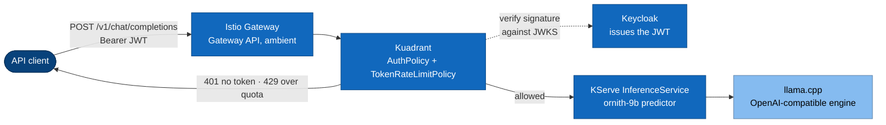

# llm-serving-stack

**A cloud-native LLM inference platform on Kubernetes, built layer by layer and
proven by running it.** It serves an OpenAI-compatible API behind identity,
token quota, telemetry, and autoscaling. It runs on a laptop first and on GPU
nodes later, without changing the control plane or the shape of this repository.

Infrastructure only: Kubernetes manifests, Helm values, shell, Kyverno policies,
bats tests, and a small Python benchmark harness. It builds no container image
of its own.

- **What it is:** [What this is](#what-this-is) - [The stack](#the-stack)
- **How it is designed:** [`docs/sad/`](docs/sad/README.md), an arc42 document with C4 diagrams
- **What is actually proven:** [`docs/STATUS.md`](docs/STATUS.md) - read this before trusting anything else
- **Run it:** [Getting started](#getting-started)

## What "cloud native" means here

The phrase is used precisely, not as decoration. Four properties, each with the
file that delivers it:

| Property | What it means here | Where |
|---|---|---|
| **Declarative** | Every object is a manifest in git. Nothing is clicked in a web UI, because a click cannot be reproduced | the whole tree |
| **Pull based** | The cluster pulls its desired state from git. CI never holds a credential to any cluster | `clusters/local-kind/` |
| **Policy as data** | Identity, quota, and admission rules are CRDs the platform enforces, not code inside the application | `security/oidc/`, `policy/` |
| **Portable across substrate** | The same control plane runs on `kind` and on GPU nodes. Changing hardware changes an overlay, not a design | `models/*/overlays/` |

And one property specific to **LLM** serving, which generic cloud-native
guidance gets wrong:

> **Cost is measured in tokens, not in requests.** `POST /v1/chat/completions`
> with `max_tokens: 8` and the same call with `max_tokens: 8000` are identical
> to anything counting requests. So quota is counted from the response's own
> `usage.total_tokens` field, and autoscaling reads queue depth rather than CPU.
> A GPU at 100% cannot tell you whether it is keeping up.
> ([`docs/04-why-kuadrant.md`](docs/04-why-kuadrant.md),
> [`docs/06-why-otel.md`](docs/06-why-otel.md))

## What this is

An answer to a specific question: what is actually missing when a tutorial calls
a model deployment "production ready"? The usual walkthrough gets a model
answering on localhost. It has no identity, no quota, no telemetry, no
autoscaling that means anything, no failure plan, and no measurements.

This repository adds those, one layer at a time, and records why each layer
exists.

## The request path



No datastore is queried on the request path. Keycloak signs the token once, at
issue time; the gateway verifies the signature against a public key. That is
what keeps the inference path stateless and replaceable pod by pod
([`docs/05-why-keycloak.md`](docs/05-why-keycloak.md)).

The full set of views is in [`docs/sad/`](docs/sad/README.md).

## The stack

| Layer | Choice | Why, in one line |
|---|---|---|
| Entry | Istio, ambient mode, Gateway API | Its data plane is Envoy, so it can host the `ext_proc` endpoint picker phase 3 needs ([ADR 0003](docs/adr/0003-gateway-istio-ambient.md)) |
| Policy | Kuadrant: `AuthPolicy`, `TokenRateLimitPolicy` | It counts `usage.total_tokens`, and it installs on either gateway, so the gateway choice stays reversible ([ADR 0004](docs/adr/0004-policy-layer-kuadrant.md)) |
| Identity | Keycloak, realm imported from git | A JWT claim carries the tier, so quota needs no lookup ([`docs/05-why-keycloak.md`](docs/05-why-keycloak.md)) |
| Control plane | KServe, Standard deployment mode | One contract for every model; no Knative, because scale to zero fights availability when weights are gigabytes ([ADR 0002](docs/adr/0002-standard-mode-not-knative.md)) |
| Engine | llama.cpp (arm64) locally, vLLM on GPU | `kserve/huggingfaceserver` is `linux/amd64` only and Rosetta 2 has no AVX ([ADR 0005](docs/adr/0005-two-runtimes-one-control-plane.md)) |
| Scaling | KEDA on queue depth | A saturated engine shows nothing on CPU ([`docs/06-why-otel.md`](docs/06-why-otel.md)) |
| Telemetry | Prometheus, Grafana, OpenTelemetry Collector | Engine series are normalised into `llmstack:*` so no dashboard names an engine ([ADR 0006](docs/adr/0006-metric-normalisation.md)) |
| Delivery | GitHub Actions for CI, Argo CD for CD | A laptop cluster has no inbound path for a push-based pipeline ([`docs/07-why-gitops.md`](docs/07-why-gitops.md)) |

Every choice has an ADR in [`docs/adr/`](docs/adr/) with the evidence behind it.

## Status

**Run for the first time on 2026-08-19.** Three of the nine phase 1 acceptance
criteria hold. Thirteen layers came up on a 3-node `kind` cluster and the service
answered a real request: 401 without a token, 200 with a JWT, and a streaming
chat completion. Argo CD reached the same working service from git on 2026-08-20,
and CI ran for the first time the same day.

Eighteen defects came out of those runs, and static review had missed all of
them. That is the point of the next link.

> **[`docs/STATUS.md`](docs/STATUS.md) is the tracked account** of what is
> proven, what is unproven, what is doubted on technical grounds, and what is
> unverified by construction. It carries the nine criteria with the command that
> settles each one. Do not read a green check anywhere in this repository as
> evidence without it.

## Phases

| Phase | Where | Model | New capability |
|---|---|---|---|
| 1 | kind on Apple M4, no GPU | Ornith-1.0-9B, quantised | The whole loop: identity, quota, telemetry, autoscaling, HA drill, CI, benchmark |
| 2 | one GPU node | Ornith-1.0-9B, bf16 | Real vLLM metrics, prefix caching, honest latency numbers |
| 3 | several GPU nodes | a large open-weight model | Cache-aware routing, prefill/decode separation, multi-node parallelism |

Phase 1 does not ship a weaker version of phase 2. It ships every layer except
the GPU, which is what makes the later phases a change of overlay rather than a
rewrite.

## Two constraints that shaped everything

1. `kserve/huggingfaceserver` publishes `linux/amd64` only, and Rosetta 2 does
   not implement AVX, so an emulated x86 vLLM cannot run on Apple Silicon.
   Therefore the local engine is llama.cpp, and everything above the engine is
   engine independent.
2. Recovery time for an LLM service is dominated by model download, not by
   applying YAML. So the recovery drill measures time to the first token, not
   time to `Ready`.

Both are recorded with dates in tracked documents. The first is
[ADR 0005](docs/adr/0005-two-runtimes-one-control-plane.md), which states the
`linux/amd64`-only constraint and what follows from it. The second is
[the recovery drill runbook](docs/runbooks/recovery-drill.md), which measures
the arrival of the first streamed chunk rather than `Ready`.

## Getting started

Prerequisites: `kubectl`, `helm`, `kind`, `task`, `yq`, `jq`, `bats`,
`kustomize`, and Docker Desktop with at least 8 CPUs and 20 GiB of memory
allocated. `task preflight` checks all of this and fails with a specific message
if something is missing.

```bash
task preflight        # verify tools and Docker resources
task local:up         # kind cluster -> Argo CD -> every platform layer, in sync-wave order
task test:smoke       # tests/smoke: identity, quota, autoscaling, availability, gitops, policy
task test:contract    # tests/contract: the engine contract, so engines stay swappable
task token            # obtain a JWT from Keycloak
task chat             # send one streaming chat completion
task bench            # run every benchmark scenario, write a dated result directory
task drill:recovery   # delete the llm namespace, let Argo CD rebuild it, measure recovery time
task local:down       # delete the cluster
```

`task local:up` applies exactly two things by hand: Argo CD itself, and
`clusters/local-kind/root-app.yaml`. Everything else arrives as an Argo CD
Application, ordered by sync wave. It ends with
`clusters/local-kind/verify-serving.sh`, which asserts the request path rather
than the Application list, because run 3 exited 0 over an unauthenticated
gateway and the Application list said nothing was wrong.

`task chat` is the human-facing way to reach the model. It goes through the
gateway, so one command exercises the route, the `AuthPolicy`, and the
`TokenRateLimitPolicy`:

```bash
task chat -- "Explain sync waves in two sentences."
CLIENT=llm-tier-free task chat    # spend the free tier's budget and watch the 429
```

To bring the stack up one layer at a time with a memory guard, use
`./tools/step-up.sh`. [`docs/deployment-walkthrough.md`](docs/deployment-walkthrough.md)
has a dated cost for every layer.

`task local:status` and `task drill:drain` are stubs; they print what they would
do. `task --list-all` shows every task.

## Layout

```
docs/sad/      the architecture document: arc42 sections, C4 diagrams
docs/adr/      one decision per file, append-only
docs/          why each layer exists, runbooks, the status account
platform/      cluster components, numbered by install order
security/      authentication and token quota policies
runtimes/      one ServingRuntime per engine
models/        one directory per model; the model is a variable
clusters/      Argo CD composition per environment
bench/         benchmark scenarios and dated results
tests/         smoke tests and engine contract tests
policy/        admission policies, shared by CI and cluster
```

## Rules this repository follows

- A number without the date it was measured is invalid. Re-measure instead of
  quoting forward.
- A passing dry-run proves the chart rendered. It does not prove the rendered
  values are the intended ones. Read the rendered output.
- Images are pinned by digest, never by a floating tag, and
  `policy/disallow-floating-tags.yaml` enforces it at admission.
- Configuration lives in git. Anything clicked in a web UI cannot be reproduced
  and does not count.
- Upstream version numbers come from the release notes of the exact version
  installed, recorded in `versions.yaml` with the date they were read.

## Documentation

| Read this | For |
|---|---|
| [`docs/sad/`](docs/sad/README.md) | The architecture: context, building blocks, runtime flows, deployment, quality |
| [`docs/STATUS.md`](docs/STATUS.md) | What is proven and what is not, criterion by criterion |
| [`docs/adr/`](docs/adr/) | Why each choice was made, with the evidence and the cost accepted |
| [`docs/01-why-*.md`](docs/) | What breaks if a layer is removed |
| [`docs/deployment-walkthrough.md`](docs/deployment-walkthrough.md) | What running it actually cost, and the defects it found |
| [`docs/runbooks/`](docs/runbooks/) | Failure, written down before it happens |

## License

Apache License 2.0. See [`LICENSE`](LICENSE) and [`NOTICE`](NOTICE).

This repository vendors no third-party source and publishes no image. Every
component it installs is fetched from that project's own registry under that
project's own licence, pinned by digest in `versions.yaml`.
