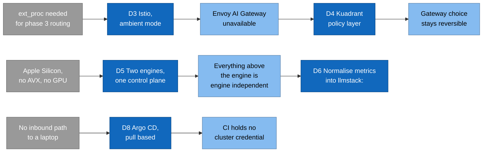

# Production Ready Is A Verb

## Part 1: The nine questions a tutorial does not ask

This is the first of seven parts about building an LLM inference platform on
Kubernetes. It runs on a laptop today and on GPU nodes later, and every layer
in front of the model is already there.

**Answer first.** The platform serves an OpenAI-compatible API behind identity,
token quota, telemetry, autoscaling, admission policy, and pull-based delivery.
It came up on a three-node `kind` cluster on 2026-08-19. On 2026-08-20,
`task local:down && task local:up` took a deleted cluster to a ready service in
**17 minutes 9 seconds**, exit 0, with no step run by hand.

**Four of the nine acceptance criteria hold as of 2026-08-20.** That number
moved in both directions on the same day. This series will tell you which four,
and why the other five are still owed. If you want the scoreboard before the
story, it is in [`docs/STATUS.md`](../STATUS.md).

---

## The tutorial ends where the work starts

The usual walkthrough gets a model answering on `localhost`. It is a good
tutorial. It is also finished at the exact point where the interesting problems
begin.

Count what that deployment does not have:

- No identity. Anyone who can reach the port can spend your compute.
- No quota. One caller can ask for eight tokens or eight thousand.
- No telemetry that means anything. CPU and average latency are the wrong two
  numbers for this workload, and I will show you why below.
- No autoscaling that means anything, for the same reason.
- No failure plan. Nothing written down about what to do when a node goes.
- No measurements. Nothing dated, so nothing that can be re-checked.

This repository exists to add each of those as its own layer, and to record why
the layer exists. It is infrastructure only: Kubernetes manifests, Helm values,
shell, Kyverno policies, `bats` tests, and a small Python benchmark harness. It
builds no container image of its own.

## Nine questions, and one command each

"Production ready" is not a property you can assert. So phase 1 was given nine
acceptance criteria, each settled by one command. They are the definition of
done, and they are the reason this series can tell you what is proven and what
is not.

| # | Criterion | Status on 2026-08-20 |
|---|---|---|
| 1 | `task local:up` takes an empty machine to a ready service | **Holds.** Run 4, 17m09s, exit 0, no manual step |
| 2 | A JWT from Keycloak returns a streamed chat completion | **Holds** since 2026-08-19 |
| 3 | A request without a JWT is rejected with 401 | **Holds on an idle cluster.** Degrades to 500 under sustained load. Never 200 |
| 4 | Exceeding the token quota returns 429 | **Holds**, in CI and locally |
| 5 | Grafana shows TTFT p95 and requests waiting from real traffic | Untested |
| 6 | Under load, KEDA scales the predictor above its floor of 2 | **Partly, and the test would pass anyway.** Part 5 |
| 7 | Draining a node keeps the service available | Untested |
| 8 | The recovery drill runs and its recovery time is committed | Untested |
| 9 | CI is green on an arm64 runner | **Flaky.** Four green, four red, then green again |

Criterion 3 is the one to read twice. It holds on a quiet cluster and it
degrades under load, and both halves of that sentence are true at once. Part 3
explains the mechanism, which turned out to be more interesting than the
symptom.

Criterion 9 taught a smaller lesson that is worth stating early. This
repository claimed criterion 9 held, on four green samples. It stopped holding
on the next push. Four samples is a measurement. "Holds" is a claim about the
future, and four samples did not support it.

## "Cloud native" is used precisely here, not as decoration

Four properties, each with the thing that delivers it:

| Property | What it means here |
|---|---|
| **Declarative** | Every object is a manifest in git. Nothing is clicked in a web interface, because a click cannot be reproduced |
| **Pull based** | The cluster pulls its desired state from git. CI never holds a credential to any cluster |
| **Policy as data** | Identity, quota, and admission rules are CRDs the platform enforces, not code inside the application |
| **Portable across substrate** | The same control plane runs on `kind` and on GPU nodes. Changing hardware changes an overlay, not a design |

Then there is a fifth property, specific to LLM serving, and it is the one
generic cloud-native guidance gets wrong.

## Cost is measured in tokens, not in requests

`POST /v1/chat/completions` with `"max_tokens": 8` and the same call with
`"max_tokens": 8000` are identical to anything counting requests. Same route.
Same method. Same client. Same JSON shape. One of them can cost a thousand
times more compute than the other.

Only the response's own `usage.total_tokens` field says which one cost more,
and that field does not exist until the engine has finished answering. So a
request-count limit protects against the wrong thing. It caps how often someone
asks. It does not cap how much the asking costs, and for a generative model
those two are only loosely related, because the caller chooses both the prompt
length and `max_tokens`.

Two consequences run through the whole design:

1. **Quota is counted from the response.** `TokenRateLimitPolicy` reads
   `usage.total_tokens` and keys the counter on a `tier` claim inside the JWT,
   not on the route. Both tiers share `/v1/*`, so the route cannot be the key.
2. **Autoscaling reads queue depth, not CPU.** A request queued behind a full
   batch raises no CPU at all. The processor computing the batch already in
   flight can sit near 100% while a second request waits its entire turn.
   **A GPU at 100% cannot tell you whether it is keeping up.**

Here is where the second consequence gets uncomfortable, and it is the reason
this series is a field report rather than a showcase.

For one day, four files in this repository stated that the free-tier quota was
not reachable on the local engine. The reasoning was arithmetic: the free tier
allows 500 tokens per 60 seconds, and llama.cpp on this machine **generates**
0.55 tokens per second, which is 33 tokens per window. Every number in that
sentence is correct, and every one carries the date it was measured.

The conclusion was still wrong. `usage.total_tokens` is prompt tokens **plus**
completion tokens. Generation rate is one way to spend a budget, not the only
one. Measured on 2026-08-20 at 06:55Z, with a prompt of roughly 500 tokens and
`max_tokens: 1`:

```
request 1  ->  HTTP 200   usage.total_tokens=552
request 2  ->  HTTP 429
```

Two requests settled it. The lesson is not about tokens. A correct, dated,
carefully-sourced number was used to support a claim, and nobody measured the
claim, because the arithmetic looked conclusive. The rule about dating numbers
did not catch this, because the number was never the problem.

## Two constraints that shaped every later decision

A constraint is a rule the architecture may not break. Two of them did most of
the work here.

**Constraint one: the local engine cannot be vLLM.** Development happens on an
Apple M4, arm64, 32 GB, with no GPU. Three findings, each dated 2026-08-17,
close off the obvious path:

- `kserve/huggingfaceserver` publishes `linux/amd64` only. Queried on Docker
  Hub, both `:latest` and `:v0.20.0` return a single platform entry.
- Rosetta 2 implements no AVX, AVX2, or AVX512. The x86 CPU build of vLLM
  depends on them, so emulation ends in an illegal instruction, not in slow
  success.
- vLLM does support arm64 CPUs, and there is no prebuilt wheel or image. It
  must be built from source.

So the local engine is llama.cpp on arm64, and vLLM waits for phase 2. That is
not a compromise made to work around a laptop. It is the point: a repository
that has actually swapped engines has proved that the engine is a plug-in,
instead of claiming it.

**Constraint two: recovery time is dominated by model download, not by applying
YAML.** So the recovery drill measures the arrival of the first streamed chunk,
not the moment a pod reports `Ready`. A drill that measures `Ready` on an LLM
service measures the wrong event by a wide margin.

## Eight decisions, and the chain they form

A constraint forces a decision. The decision has a consequence the next
decision has to live with. Read this left to right.



| # | Decision | What it buys |
|---|---|---|
| D1 | A control plane, not hand-written Deployments. KServe `InferenceService` plus `ServingRuntime` | One contract for readiness, port naming, labels, and the predictor Deployment name |
| D2 | KServe Standard mode, not Knative. No scale to zero by default | Availability. Weights are gigabytes, so a cold start is minutes |
| D3 | Istio in ambient mode, through Gateway API | Its data plane is Envoy, so it can host the `ext_proc` endpoint picker phase 3 needs |
| D4 | Kuadrant for both authentication and quota | `TokenRateLimitPolicy` reads `usage.total_tokens`. And it installs on either gateway, which keeps D3 reversible |
| D5 | Two engines, one control plane | Development on the real platform rather than a simulation of it |
| D6 | Normalise engine metrics into an `llmstack:` namespace | No dashboard, alert, or scaling trigger names an engine |
| D7 | Identity is a signed JWT, not an API key table | No datastore on the request path |
| D8 | Delivery is pull based. Argo CD reconciles from git | No network path from CI into any cluster |

Every one of these has an ADR in `docs/adr/` with its context, its options, the
cost accepted, and the evidence with the date it was read. Parts 2 to 6 walk
them one at a time.

## What was deliberately not chosen

Naming the rejected option is as load-bearing as naming the chosen one. A
rejection is only reversible if its reason is written down.

| Not chosen | Why not | Reversible? |
|---|---|---|
| **Envoy Gateway** | KServe's documented default, and it does support `ext_proc`. Istio won because Kuadrant had to survive a gateway change, and Istio adds east-west mTLS | Yes. The gateway is confined to `platform/10-istio/` |
| **Envoy AI Gateway** | It requires Envoy Gateway as its base, which D3 ruled out. Kuadrant fills the same gap | Only by reversing D3 |
| **Traefik** | 100% Gateway API conformance, and no evidence of `ext_proc` support was found. It is not built on Envoy | Would need evidence that does not exist today |
| **Knative serverless mode** | Scale to zero fights availability for this workload. Another control plane, too | Yes, per overlay. The `cost-saving` overlay is the opt-in |
| **Autoscaling on CPU** | CPU cannot tell "busy and keeping up" from "busy and falling behind" | No reason to |
| **Rate limiting by request count** | One request can cost a hundred tokens or a hundred thousand | No reason to |
| **Push-based delivery** | It needs a network path from a CI runner into a laptop, plus a credential | No reason to |

On Traefik, the honest statement is that no evidence of `ext_proc` support was
found. That is not the same as proof of absence, and the record says so.

## Four boundaries hold the design together

Breaking one of these is a design change, not a fix.

```mermaid
graph TB
  subgraph b1["Boundary 1 - the model is a variable"]
    m[models/ornith-9b/]:::comp -.->|"may not name"| r[runtimes/llamacpp-arm64/]:::comp
  end
  subgraph b2["Boundary 2 - the engine is swappable"]
    above["Gateway, policy, identity,<br/>dashboards, tests"]:::comp -.->|"may not name"| eng[any engine]:::comp
  end
  subgraph b3["Boundary 3 - metrics are normalised"]
    raw["llamacpp:* / vllm:*"]:::ext -->|recording rules| norm["llmstack:*"]:::comp
    norm --> cons["dashboards, alerts,<br/>KEDA trigger"]:::comp
  end
  subgraph b4["Boundary 4 - delivery is pull based"]
    g[git]:::ext -->|"Argo CD pulls"| cl[cluster]:::comp
  end

  classDef comp fill:#85bbf0,stroke:#5d82a8,color:#000000
  classDef ext fill:#999999,stroke:#6b6b6b,color:#ffffff
```



| # | Boundary | The rule |
|---|---|---|
| 1 | The model is a variable | A model name must never appear in `runtimes/`. Changing models touches `models/<model>/` and nothing else |
| 2 | The engine is swappable | Everything above the engine is engine independent. `tests/contract/` exists only to keep it that way |
| 3 | Metrics are normalised | Dashboards, alerts, and the KEDA trigger read only `llmstack:*`, never a raw engine series |
| 4 | Delivery is pull based | `task local:up` applies exactly two things by hand: Argo CD, and one root Application |

Boundary 1 is easy to state and easy to break. The test is mechanical: open
`runtimes/llamacpp-arm64/servingruntime.yaml` and search for the model name. It
is not there, and the file carries a comment saying why the `--alias` flag
lives in the model's own `InferenceService` instead.

## Three phases, and each one adds hardware rather than architecture

| Phase | Where | Model | New capability |
|---|---|---|---|
| 1 | `kind` on Apple M4, no GPU | Ornith-1.0-9B, Q4_K_M, 5.6 GB | The whole loop: identity, quota, telemetry, autoscaling, HA drill, CI, benchmark |
| 2 | One GPU node | Ornith-1.0-9B, bf16 | Real vLLM metrics, prefix caching, honest latency numbers |
| 3 | Several GPU nodes | A large open-weight model | Cache-aware routing, prefill and decode separation, multi-node parallelism |

Phase 1 does not ship a weaker version of phase 2. It ships every layer except
the GPU. That is what makes the later phases a change of overlay rather than a
rewrite.

## What it costs, measured rather than estimated

Thirteen layers, fifteen Argo CD Applications, and one root Application that
creates them, in six sync waves. Numbers from a three-node `kind` cluster with
Docker Desktop given 10 CPUs and 23.2 GiB:

| What | Number | Measured |
|---|---|---|
| Platform layers, empty machine to Argo CD running | 9 minutes 59 seconds | 2026-08-19 |
| Memory after the platform layers, before any model | 7.0 GiB, 29% of the allocation | 2026-08-19 |
| Memory with both models resident | 17855 MiB, 75% | 2026-08-19 |
| The same, after a Docker restart | 17576 MiB, 74% | 2026-08-20 |
| Full rebuild, `local:down && local:up` | 17 minutes 9 seconds, exit 0 | 2026-08-20 |

The model layer dominates memory: about 10.7 GiB, more than every platform
layer combined. Two layers dominate the clock, Kuadrant and observability, at
237 of the 599 seconds.

One number is worth naming because it unblocked the whole project. This
repository was code-complete and unrun for two days, because Docker Desktop had
7.7 GiB and `kind` needed more. Raising the allocation to 23.2 GiB was the only
change that made the first run possible.

## What running it found, and why part 1 says this now

The first run found **seven defects that four separate static review passes
over the whole repository had all missed**. A file mode. A bash 3.2 array
expansion. Two selectors naming a label Istio removed in 1.24. And three tests
that passed while the thing they named was broken.

Then the pull-based path ran, three times, and found fifteen more. None of the
fifteen was visible from the imperative path. Eighteen defects in total, from
runs that each took under twenty minutes.

Four sentences came out of that, and they are the spine of the six parts that
follow:

> **Rendering is not admission. Admission is not scheduling. A passing test is
> not a working system. And a green pipeline is not a working platform.**

Each of those has a specific, dated incident behind it. `kustomize build`
rendered every model overlay and `task lint` passed, while KServe's webhook
would have rejected all of them. KEDA scaled to a third replica that can never
be scheduled on this cluster, and the autoscaling test passes anyway, because
it asserts the number KEDA writes rather than the number of pods serving
traffic. Sixteen Argo CD Applications reported `Synced` and `Healthy`, the run
exited 0, and the first request to the gateway with no token at all returned
HTTP 200.

That last one is why `task local:up` no longer ends by reading the Application
list. It ends by asserting the request path: 401 without a token, then 200 with
a real JWT.

## What the rest of the series covers

| Part | Subject |
|---|---|
| 2 | The way in. Gateway API, Istio in ambient mode, and why the choice comes down to one Envoy filter |
| 3 | Identity and cost. Keycloak, Kuadrant, Authorino, Limitador, and the 500 that should have been a 401 |
| 4 | The control plane and the engine. KServe, `ServingRuntime`, and three defects that rendered perfectly |
| 5 | Telemetry that means something. OpenTelemetry, Prometheus recording rules, and KEDA on queue depth |
| 6 | Delivery and guardrails. Argo CD, sync waves, Kyverno, and digest pinning |
| 7 | What running it cost. The scoreboard, the webhook race, the load test, and the benchmark that outlived its own token |

---

*Every number in this article carries the date it was measured, because a number
without that date cannot be re-checked. The tracked account of what is proven
and what is not is [`docs/STATUS.md`](../STATUS.md). Where this article and that
file disagree, that file is right.*
