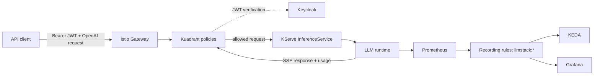
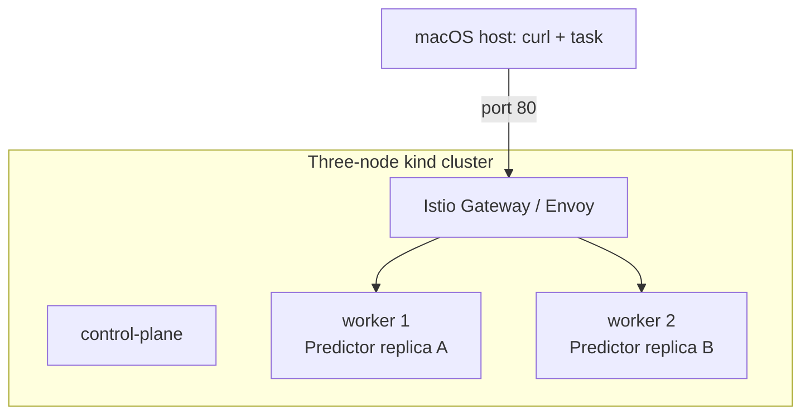
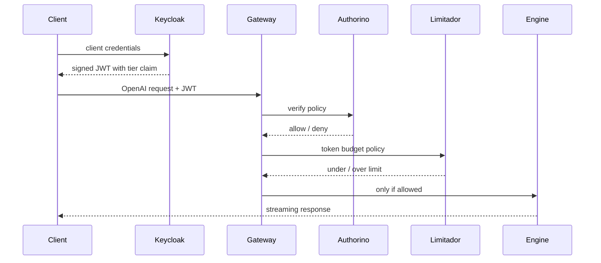
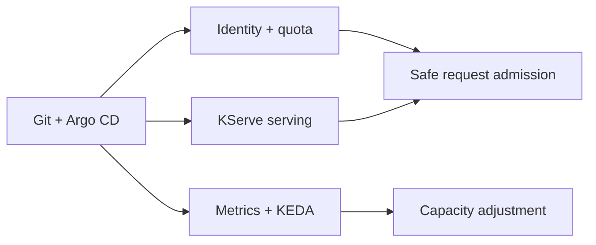

# Building a Cloud-Native LLM Serving Platform: What Comes After the First Successful Prompt

Most LLM deployment tutorials end with a reassuring moment: a model answers a
prompt on `localhost`.

That is a useful milestone. It is not yet a platform.

The questions begin immediately afterwards. Who is allowed to spend inference
capacity? How is a tenant prevented from turning one small request into an
expensive generation? What does “healthy” mean when model weights take minutes
to load? Which metric tells us that the serving engine is falling behind? Can a
laptop development environment evolve into GPU infrastructure without rewriting
the system around it?

I built `llm-serving-stack` to explore those questions as infrastructure, not
as a slide deck. It is an open-source, cloud-native LLM inference platform on
Kubernetes. It serves an OpenAI-compatible API behind identity, token quota,
observability, autoscaling, admission policy, and GitOps delivery. The project
runs first on a local Apple Silicon `kind` cluster and is designed to move to
GPU nodes later without changing the control plane.

The important distinction is deliberate: this repository does not claim that a
model deployment is automatically production ready. It records which behaviours
have been observed, which are still unproven, and which design ideas were
withdrawn when testing showed they would not work.

## The architecture: a platform in front of the model

The model is only the final hop in the request path. Everything before it exists
to turn raw inference capacity into a service that can be operated responsibly.



Istio provides the Gateway API entry point; Kuadrant applies authentication and
token policies; Keycloak issues signed JWTs; KServe supplies the serving
contract; and llama.cpp or vLLM is the engine. Prometheus, Grafana, an
OpenTelemetry Collector, and KEDA complete the operational loop, while Argo CD
reconciles the desired state from Git.

Each component establishes a concrete property: identity prevents anonymous
compute consumption, quota constrains it, KServe avoids hand-maintained serving
workloads, telemetry gives scaling a signal, and GitOps makes the cluster
reproducible.

## The LLM-specific decision: cost is measured in tokens, not requests

Traditional API rate limiting often counts requests. That is a poor economic
model for generative inference.

Two calls to `POST /v1/chat/completions` can look identical at the gateway but
have completely different cost. One might ask for eight completion tokens;
another might supply a very long prompt and request thousands. A request count
can restrict how often a client asks. It cannot represent how much inference
the client consumes.

For that reason, this stack uses Kuadrant’s `TokenRateLimitPolicy` to count
`usage.total_tokens` from the OpenAI-compatible response. The policy is keyed
on a tier claim carried in the JWT: the free tier receives 500 tokens per
60-second window and the pro tier receives 100,000. Authentication, caller
identity, and cost control are therefore policy objects enforced at the gateway,
not application code added to every model.

The final cost is known only after the engine responds, which makes accounting
grounded in actual consumption rather than caller intent.

## Why KServe, but not scale-to-zero by default

KServe is the control plane for model serving in this design. Its
`InferenceService` and `ServingRuntime` resources establish one contract for
readiness, ports, labels, predictor ownership, and model deployment. That
contract lets policy, monitoring, and scaling components integrate once instead
of being rebuilt for every engine and model.

I chose KServe’s Standard deployment mode rather than Knative serverless mode.
Scale to zero is attractive for ordinary web workloads, but model weights are
measured in gigabytes. A cold start is often minutes rather than milliseconds.
For an always-available inference service, scaling to zero can transform a cost
optimization into an availability incident.

The local configuration keeps two replicas and a `minAvailable: 1`
PodDisruptionBudget. Scale-to-zero remains an explicit, measurable cost-saving
overlay rather than the default.

## Two runtimes, one control plane

The local development constraint shaped a central architectural boundary.

The project was built on Apple Silicon, where the practical serving path is
llama.cpp on arm64. The x86/AVX-oriented path normally used by the relevant
KServe runtime cannot simply be emulated through Rosetta, and the local machine
has no GPU. On GPU infrastructure, vLLM is the target runtime.

It would have been tempting to maintain a “local stack” and a separate “real
GPU stack.” Instead, the project separates model facts from runtime facts.
Model configuration lives under `models/`; engine configuration lives under
`runtimes/`. KServe remains the control plane above both.

```text
models/ornith-9b/        model name, format, alias, overlays
runtimes/llamacpp-arm64/ engine image, arguments, probes, resources
platform/                gateway, policy, telemetry, scaling, GitOps
```

An engine change affects the runtime and environment overlay, not the API,
identity model, route policy, dashboards, or delivery workflow. Contract tests
check the API surface, readiness, and image architecture to protect that
boundary.

## Scaling on queue depth, not CPU

Autoscaling is another place where generic Kubernetes instincts can mislead.

CPU saturation tells us that an engine is busy. It does not tell us whether it
is keeping up. An LLM server can be processing a full batch at 100% CPU or GPU
utilization while more requests accumulate behind it. From the caller’s view,
the important signal is the queue.

Prometheus turns raw engine series into a stable `llmstack:` namespace through
recording rules. KEDA scales on `llmstack:requests_waiting`; Grafana uses the
same normalized metrics. A new engine changes recording rules, while dashboards
and scaling triggers remain stable.

Some observability gaps are documented rather than hidden. llama.cpp does not
provide every signal available from vLLM, such as prefix-cache statistics or
KV-cache utilization. It also does not expose the per-request latency histogram
needed for an engine-derived time-to-first-token percentile. The project fills
TTFT with a client-side streaming prober and labels it as synthetic. An empty
dashboard panel is ambiguous; an explicit “not available on this engine” panel
is operationally honest.

## GitOps is a security and reproducibility decision

GitHub Actions validates the repository. Argo CD delivers it.

This split is intentional. A laptop cluster has no sensible inbound network
path from a hosted CI runner, and providing CI with a long-lived cluster
credential would add a secret and attack surface for little benefit. Instead,
Argo CD runs inside the cluster and pulls desired state from Git.

The local environment applies only Argo CD and a root Application by hand. Argo
CD then composes the remaining layers in ordered sync waves, from Gateway API
CRDs and certificates through the model and route-dependent policies.

Every image is pinned by digest, chart versions are recorded, and Kyverno
admission policies reject floating image tags, missing resource limits, and
missing labels. These are not conventions relying on review discipline; they
are executable constraints enforced by the cluster.

## What running the platform changed

The most valuable output of this project was not a clean architecture diagram.
It was the defects found after the manifests met a real cluster.

On 2026-08-20, a deleted local cluster reached a ready service through the
pull-based path in 17 minutes and 9 seconds, with no manual steps. The request
path was independently verified: an unauthenticated request returned 401, a
real Keycloak JWT returned 200, and the model streamed a response.

But sustained load exposed three important limitations.

First, KEDA correctly raised the desired replica count to three when queue depth
grew, but the third pod could never schedule. The local cluster has two usable
worker nodes, while a strict topology-spread rule keeps replicas distributed.
With `maxReplicaCount: 3`, `maxSkew: 1`, and `DoNotSchedule`, the desired state
is arithmetically impossible. The autoscaler was not broken; the capacity and
availability rules contradicted each other.

Second, the authentication path degraded under concurrency. Requests without a
token should return 401 and valid requests should return 200, but some instead
returned 500 while Authorino could not complete OIDC discovery against
Keycloak. The system failed closed—it did not grant unauthorized access—but a
correct rejection status matters. “Not 200” is not an adequate security test.

Third, CI demonstrated flakiness after several green runs, including failures
on documentation-only commits. This corrected a tempting but false conclusion:
four successful samples are a measurement, not proof that the pipeline will
remain reliable.

These findings remain documented as current status, not silently edited out.
A green diagram, a successful render, and even a passing deployment are
incomplete evidence until the request path has faced realistic conditions.

## From laptop cluster to GPU fleet: portability without pretending equivalence

“Cloud native” is sometimes used as a synonym for “uses Kubernetes.” I use it
more narrowly in this project. It means the system is declarative, pull based,
policy driven, and portable across its intended substrate. Each property has a
concrete implementation in the repository.

Declarative means every Kubernetes object is stored in Git. The desired state is
not reconstructed from screenshots or from a command a person happened to run
once. Pull based means Argo CD, running inside the cluster, observes Git and
reconciles that desired state; CI does not push changes into the cluster. Policy
as data means authentication, quota, image pinning, resource limits, and labels
are expressed as resources the platform enforces. Portability means an engine or
hardware change is isolated to a runtime and environment overlay rather than
duplicating the whole architecture.

The first environment is deliberately modest: one control-plane node and two
worker nodes in `kind`, running on an Apple M4 host. Docker Desktop is allocated
10 CPUs and 23.2 GiB of memory, and preflight requires at least 8 CPUs and
20 GiB. The gateway is exposed through a NodePort mapping to the host. Two
predictor replicas run on different worker nodes, with a strict topology spread
constraint and a PodDisruptionBudget to make a node-drain scenario meaningful.



The local topology is not a claim that a laptop behaves like a production GPU
fleet. It is a proving ground for the parts that should not depend on GPU
hardware: routing, identity, quota, GitOps ordering, policy enforcement,
metrics plumbing, failure handling, and the OpenAI-compatible contract. The
GPU phases then add capacity-specific behaviour without rebuilding those layers.

Phase 2 targets one GPU node. Its planned changes are a vLLM ServingRuntime,
real vLLM metrics, prefix-cache information, and latency numbers that make
sense on an accelerator. Phase 3 targets several GPU nodes and adds cache-aware
routing, prefill/decode separation, and an `ext_proc` endpoint picker. The
choice of Istio’s Envoy data plane was influenced by that future extension
point, while Kuadrant was selected so the policy layer could remain usable even
if the gateway choice later changes.

The GPU overlays are intentionally buildable but empty today. That is not a
marketing shortcut. It distinguishes a planned attachment point from a deployed
capability. There is no GPU cluster run recorded by the project, so no GPU
throughput or cache-hit claim appears as an achievement.

## The deployment order is architecture, not installation trivia

A platform with many controllers has an order of operations whether it admits
it or not. Hiding that order in a shell history turns it into tribal knowledge.
This stack makes it explicit through Argo CD sync waves.

The root application creates the applications for the platform. Gateway API
CRDs and cert-manager arrive first. The mesh, policy engine, and identity layer
follow. KServe and Kuadrant come next, then observability and KEDA, then the
model, and finally the policies that depend on a route which already exists.
Each wave waits for the previous wave to be healthy.

```text
Wave 0  Gateway API CRDs, cert-manager
Wave 1  Istio, Kyverno, Keycloak
Wave 2  KServe, Kuadrant
Wave 3  Prometheus/Grafana/OTel/Tempo, KEDA
Wave 4  ServingRuntime, InferenceService, HTTPRoute, PDB, ScaledObject
Wave 5  AuthPolicy, TokenRateLimitPolicy
```

The sequence sounds obvious after it is written down. Running it showed why
writing it down is necessary. Gateway API resources fail if their CRDs do not
exist. KServe requires certificate support for its webhook. Policies relying on
a route cannot meaningfully attach before the route exists. And an application
being reported “Healthy” does not necessarily prove that it has synchronized the
intended Git path.

That last point was discovered in a real pull-based run. An Argo CD Application
whose Git path could not be read still reported a healthy status. The first
automation therefore exited successfully on an empty cluster. The repair was
not to trust a greener dashboard: `wait-for-sync.sh` now checks synchronization
status and counts expected child applications, while `task local:up` ends by
verifying the actual request path—401 without a JWT and 200 with a valid one.

The team also encountered an Argo CD implementation detail that matters for
large Kubernetes packages. Client-side apply stores configuration in an
annotation, and several charts ship CRDs larger than that annotation limit.
The same charts installed imperatively with Helm but failed through Argo CD.
The GitOps path was changed to server-side apply. This is an example of why
“Helm works on my laptop” is not evidence that the production delivery path
works; the mechanisms are different.

## Security is a request-path property

Security is often described as a collection of components: an identity provider,
a gateway, perhaps a secrets manager. For an inference platform, the more useful
question is whether an unauthorized request can reach the engine and consume
compute.

In this architecture, Keycloak is the issuer, not a database queried by every
generation. A client uses the client-credentials flow to obtain a signed access
token. Its tier travels in the JWT claim. At the gateway, Authorino verifies the
token signature against the issuer’s published keys and provides the identity
to the quota policy. The request either receives a rejection at the edge or
reaches KServe. The model does not own authentication code or a user lookup.



This is a stateless request path from the platform’s perspective. Keycloak signs
the token at issuance time; the gateway uses public verification material. The
benefit is not merely performance. It means individual predictor pods remain
replaceable and the authorization decision is consistently enforced before
expensive model execution.

The rejection semantics matter. A caller without a valid token should receive
401. A valid free-tier caller whose 500-token-per-minute budget is spent should
receive 429. Neither request should reach the engine. A 503 or a 500 is not a
successful substitute for 401 merely because it is “not authorized.” The first
load test exposed exactly why: under concurrency, Authorino’s OIDC discovery
dependency intermittently failed and the gateway responded with 500. The system
failed closed, so it was not an authorization bypass, but the operational and
API contract was still wrong.

There is a second policy boundary at admission time. Kyverno rejects images that
use floating tags, containers—including init containers—without resource
limits, and workloads without the required labels. The policies run offline in
CI and live in the cluster. This matters for ML workloads because an unbounded
init container downloading weights, or an image tag that shifts between deploys,
can undermine predictability before the model ever serves traffic.

## What observability means for a generative service

The platform’s observability design has two rules. First, metrics must answer an
operational question. Second, consumers should not depend directly on a
particular engine’s metric names.

Prometheus scrapes the predictor’s `/metrics` endpoint. Recording rules
translate those raw series into normalized names such as
`llmstack:requests_running`, `llmstack:requests_waiting`,
`llmstack:tokens_in_total`, and `llmstack:tokens_out_total`. Grafana panels and
the KEDA trigger consume these normalized names. This makes the platform’s
observability contract engine-independent even when the collection details are
not.

Time to first token is a particularly instructive example. It is the latency a
user experiences before streaming begins, and it is far more useful for chat
than a single “response time” number. llama.cpp does not expose the histogram
needed to derive a per-request TTFT percentile from the engine. Instead of
inventing a value, the stack runs a client-side prober that sends a streaming
request once per minute and records `curl`’s time-to-first-byte in Pushgateway.
The Grafana panel identifies this as a synthetic measure. That disclosure is
part of the design: synthetic telemetry can be valuable, but it must not be
mistaken for a full population measurement.

Other gaps are similarly explicit. Prefix-cache hit rate and KV-cache
utilization are unavailable from the local engine. The OpenTelemetry Collector
has a traces pipeline, but llama.cpp supplies no traces. When vLLM becomes the
runtime, the normalized metrics and telemetry map can grow; until then, the
absence is labelled rather than rendered as an empty graph that could mean
either “zero” or “broken.”

## Deployment cost is part of the design record

Cloud-native diagrams can hide the cost of their own control plane. The project
measured its local deployment layer by layer on 2026-08-19. From a new cluster
to Argo CD running, the platform layers took 9 minutes 59 seconds and reached
about 7.0 GiB across the three `kind` node containers. With both local models
resident, the cluster used 17,855 MiB—roughly 75% of the 23.2 GiB allocated to
Docker Desktop.

The expensive components were not surprising once measured. Kuadrant and the
observability stack dominated installation time. The model layer dominated
memory. What is easy to miss is that the model manifest can apply quickly while
weights are still downloading and loading. Reporting the `kubectl apply` time
as “model deployment time” would be true but misleading. The record separates
those events.

The same reasoning shapes recovery measurement. Deleting the `llm` namespace
and waiting for a `Ready` condition is not the user-relevant recovery number if
the model still needs to download weights or warm up. The recovery drill is
designed to measure time to the first streamed token. It remains an untested
criterion in the current status, but the definition of success is already
written down.

## Tests are contracts, not decoration around manifests

The repository uses several kinds of verification because each catches a
different failure mode. Static checks tell us that YAML parses, Kustomize
renders, and shell scripts have valid syntax. Kyverno tests tell us that policy
rules accept and reject their expected fixtures. Contract tests protect the
engine boundary: the runtime must be the correct image architecture, present a
healthy endpoint, and implement the expected OpenAI-compatible API surface.
Smoke tests exercise the cluster itself: gateway routing, identity, quota,
KServe, observability, autoscaling, availability, GitOps, policy, recovery, and
the benchmark harness.

The value of this split became clear during the first runs. A manifest can build
and still be rejected by an admission webhook. A test can pass because it
asserted that any command failed, even if the failure was a missing Kubernetes
context rather than a policy denial. A Prometheus query can return an `up`
series with value zero, so asserting “some series exists” proves discovery but
not scraping. These are not exotic mistakes; they are normal gaps between the
thing a test says and the property a test actually demonstrates.

Several checks were strengthened through mutation. The team deliberately broke
the policy or target configuration and confirmed that the test turned red. This
is more persuasive than simply observing a green test. If a test remains green
when its underlying mechanism is intentionally disabled, it is not protecting
the claimed behaviour.

The shell environment had its own lesson. macOS ships Bash 3.2, while hosted CI
commonly runs a newer Bash. An empty-array expansion that worked in CI caused
the KServe installation script to exit under `set -u` on the Mac. A parser can
confirm that a shell script is grammatical; only execution in the supported
runtime confirms that its semantics are portable.

The same is true of files themselves. One install script lacked its executable
bit in Git. Every content-oriented check passed, yet a fresh clone failed on the
second command of `task local:up` with permission denied. The fix added a check
for tracked executable modes, not just a local `chmod`.

These may sound like low-level details, but they support the central argument:
infrastructure reliability emerges from the exact boundary where a declaration
meets a particular runtime. Kubernetes manifests, the admission server, an
Argo CD reconciliation loop, a shell interpreter, and the Linux scheduler all
interpret configuration differently. A production claim must be tested at the
boundary it names.

## Benchmarking: the first numbers are evidence, not a victory lap

The benchmark harness contains four scenarios: a short prompt and short output;
a long-prefill case; a shared-prefix workload; and a concurrency sweep. The
intended measurements include time to first token, inter-token latency,
output-token throughput, and errors. The shared-prefix scenario is especially
useful for separating local cache reuse inside one replica from the later
multi-node cache-aware routing promise.

The first benchmark run did not produce publishable performance numbers. That
is still a useful result.

Scenario `01-short.json` sent 40 requests at concurrency 4 against two local
replicas. Its nominal figures were TTFT p50 of 186.494 seconds, TTFT p95 of
199.852 seconds, inter-token latency p95 of 29.684 seconds, and 0.210 output
tokens per second. But the error count is the part that matters: 31 of the 40
requests failed. Nine received HTTP 500 and three received 503 during the
identity-path problem; nineteen received 401 because the benchmark acquired one
JWT before a run that lasted longer than the realm’s 15-minute access-token
lifetime.

Only nine requests succeeded. The result is a measured data point, not a
credible performance claim. The correct next action is not to average away the
errors; it is to refresh the token during a benchmark and to diagnose the
gateway failure before retesting. The dated benchmark directory remains in the
repository precisely so that the bad run is inspectable rather than replaced by
a better-looking graph.

This approach changes how I think about benchmark automation. A benchmark is
not merely a load generator. It is a distributed integration test with a metric
report attached. Credentials can expire, the gateway can fail closed, a model
can be under-provisioned, and a client can misinterpret a streaming response.
Recording errors beside latency prevents an impressive percentile from hiding a
broken request path.

## Failed design ideas are part of the architecture

One of the most valuable architecture decisions in the project is a withdrawal.
Phase 1 originally described automatic fallback from the main model to a smaller
backend using a second Gateway API `backendRef` at weight zero and retries. It
looked plausible on paper. It was removed after the actual behaviour was
examined.

Envoy chooses a weighted cluster before retrying. A retry can select another
host inside that already chosen cluster; it does not return to the route’s
weighted backend selection and discover a zero-weight backend. The fallback was
therefore unreachable. A related retry configuration did not express the
desired cross-backend failover either.

The correct outcome was not to leave an attractive but nonfunctional manifest
in the repository. The design is recorded as withdrawn in an ADR, the false
phase-1 capability is removed, and the current behaviour is stated plainly:
when the engine is unavailable, callers receive an error. That is less exciting
than advertising automated fallback, but it is more useful to operators and to
the next person who considers reintroducing it.

This is why the project keeps append-only architecture decision records. An ADR
does not simply say what was selected. It describes the context, alternatives,
reasons, accepted cost, reversibility, and evidence. A later decision supersedes
an earlier one without rewriting history. The rejected options are valuable too:
Knative scale-to-zero, request-count rate limiting, CPU-based autoscaling, and
push-based CD were not ignored; they were ruled out for stated reasons.

## An honest scorecard for phase 1

The project defines phase-1 success through nine executable criteria rather
than a vague claim of production readiness. At the documented point in time,
four are known to hold, one is partly demonstrated with an important scheduling
caveat, several remain untested, and CI is flaky.

The pull-based installation criterion holds: an empty cluster reached a ready,
verified service in 17 minutes and 9 seconds with no manual step. The
OpenAI-compatible streaming request with a Keycloak JWT holds. Quota rejection
has been observed. The unauthenticated rejection holds on an idle cluster but
degrades to 500 under sustained load, so it cannot be represented by a single
unqualified green check.

Observability from real traffic, node-drain availability, and recovery to first
token still need the dedicated tests to run. Autoscaling reached the desired
replica count but not a third serving replica because the topology could not
schedule it. CI has recorded both green and red runs. These distinctions are not
an apology for an unfinished project; they are the practical difference between
an engineering record and a launch announcement.

The status document also separates three categories that are often collapsed:
unproven, doubted, and unverified by construction. An unproven feature needs a
measurement. A doubted mechanism has a technical reason to suspect it will not
work; the withdrawn cross-backend failover is the example. An item unverified by
construction cannot meet its acceptance bar until the relevant end-to-end suite
has run. Each category suggests a different next action.

## What I would carry into the next platform

This project changed my view of LLM infrastructure in a few durable ways.

First, model serving must be designed around consumption and queueing, not just
HTTP requests and CPU. Tokens are a better unit of cost, and queued requests are
a better early warning signal than utilization alone.

Second, a runtime-independent control plane is worth the effort. Hardware and
serving engines will change quickly. The policy, API, GitOps, and observability
contracts should not have to change with them.

Third, local development is useful when it validates real boundaries. An arm64
laptop cannot prove GPU throughput, but it can prove that routing, OIDC,
admission policy, delivery ordering, and engine abstraction do not depend on
the future GPU cluster.

Fourth, operational documentation should state not only how to deploy but what
the platform has actually survived. A runbook for node drain, a recovery drill
that measures first token rather than readiness, a dated benchmark result with
its failures preserved, and an ADR withdrawing an unworkable design all make
the system more trustworthy.

Finally, “production ready” is a verb. It is the ongoing practice of defining a
property, implementing it, testing it under realistic conditions, recording the
outcome, and changing the design when the evidence disagrees. A model answering
the first prompt is the start of that practice—not its completion.

## A practical map of the implementation

For readers who want to translate the architecture into a repository layout,
the following map is the shortest path through the implementation. The point is
not that every project needs the same directories. It is that each concern has
one obvious home, so changes can be scoped and reviewed as design changes rather
than as a search through a flat collection of YAML files.

| Area | Responsibility | Example outcome |
|---|---|---|
| `clusters/` | Environment composition and Argo CD applications | Local `kind` or future GPU cloud wiring |
| `platform/` | Shared control-plane components | Istio, KServe, observability, KEDA, Argo CD |
| `security/` | Request-path policy objects | JWT verification and token quota |
| `runtimes/` | Engine-specific serving configuration | llama.cpp locally, vLLM on GPUs |
| `models/` | Model-specific configuration and overlays | Model format, alias, resources, routing |
| `policy/` | Admission controls and their fixtures | Pinned images and required limits |
| `tests/` | Smoke and contract assertions | Service behaviour, not only rendered YAML |
| `bench/` | Repeatable performance scenarios and dated results | TTFT, token rate, error accounting |
| `docs/sad/` | Architecture views and quality scenarios | The structural explanation |
| `docs/adr/` | Immutable decision history | Why a choice was made or withdrawn |
| `docs/runbooks/` | Operational exercises | Recovery and node-drain procedures |

The division between `models/` and `runtimes/` is especially important. The
model definition states facts about a model: its format, the selected runtime,
and its API alias. A runtime defines the executable details: container image,
arguments, exposed ports, probes, and resource settings. Putting a model name in
a runtime would make a runtime impossible to reuse. Putting engine arguments in
a model would make a model definition depend on an implementation. This boundary
is simple enough to enforce through code review and specific enough to support a
future vLLM runtime without moving the platform around it.

The local model overlay carries concerns which are neither model facts nor
engine facts: HTTP route timeouts, topology spreading, a disruption budget, and
a KEDA ScaledObject. The streaming route uses a 600-second request timeout,
because a long answer is not a typical short web request. Predictor termination
includes a grace period and pre-stop delay so that a pod can finish an active
stream rather than being immediately killed during a rollout or drain.

The repository also records several KServe-specific details discovered only
after admission. Overrides must be placed under KServe’s `model:` field rather
than in a competing container implementation. The model volume is mounted at
`/models`, not `/mnt/models`, because KServe’s agent injector can add its own
mount at the latter path. These are small details with large operational impact:
a rendered manifest may look valid, yet the webhook can reject it or Kubernetes
can refuse a pod with duplicate mount paths.

## The control loops, stated explicitly

An LLM-serving platform is easier to reason about when its control loops are
made visible. This project has four primary loops, each with a different owner
and failure mode.

**The identity and cost loop** begins with Keycloak issuing a signed JWT and
ends when Kuadrant accounts for the response’s token usage. It protects the
model from anonymous or over-budget callers. Its failure mode is incorrect
rejection semantics or an upstream identity dependency that becomes unavailable.

**The serving loop** begins when KServe reconciles an `InferenceService` and
creates the predictor workload. It protects a uniform model-serving contract.
Its failure mode is often an admission, scheduling, image, volume, or readiness
problem rather than an error in the inference API itself.

**The elasticity loop** begins at the engine’s metrics endpoint, passes through
Prometheus recording rules, and ends when KEDA adjusts the Deployment replica
count. It protects latency under growing demand. Its failure mode is a missing
metric, a signal that measures the wrong thing, or desired capacity that the
scheduler cannot place.

**The delivery loop** begins when a commit changes desired state and ends when
Argo CD reconciles the corresponding Kubernetes resources. It protects
reproducibility. Its failure mode is not simply “sync failed”: a misleading
health status, a CRD that exceeds client-side apply limits, or a resource that
exists but does not serve the expected request path can all make a green-looking
deployment operationally wrong.



The diagram is intentionally not a strict dependency graph. A real service is
the interaction of these loops. For example, an autoscaler may request a new
replica, but the serving loop and scheduler determine whether that replica ever
becomes available. Similarly, GitOps can report every object present, but only a
request-path test can tell whether identity and routing together enforce 401.

## How I would operate this platform day to day

The project includes a deliberately small set of top-level tasks. They make the
intended operating workflow discoverable and ensure that the human path uses the
same route and policies as a real client.

```bash
task preflight       # check required local tools and Docker capacity
task local:up        # create the cluster and reconcile the platform
task test:smoke      # exercise platform behaviours against the cluster
task test:contract   # keep runtimes behind the expected API contract
task token           # obtain a JWT from the local Keycloak realm
task chat            # send a streaming OpenAI-compatible request
task bench           # execute defined benchmark scenarios
task drill:recovery  # rebuild the LLM namespace and measure first token
task local:down      # remove the local cluster
```

The ordering is purposeful. Preflight looks at Docker Desktop allocation rather
than only host memory because Docker is the resource boundary that the `kind`
nodes will actually experience. `task local:up` is useful only when it verifies
the final request path after synchronization, not when it merely reports that
Argo CD has created applications. `task chat` passes through the real gateway,
so one command exercises routing, JWT policy, token quota, and streaming.

For incident response, the project has runbooks for a node drain and recovery
drill. The node-drain procedure exists to validate that replicas really occupy
different nodes and that the PodDisruptionBudget protects one of them. The
recovery drill starts from deletion of the LLM namespace and follows GitOps
reconciliation back to the first streamed chunk. Both are more meaningful than
a generic “pods are Running” check because they express the user-visible service
property being protected.

There is also an important restraint in the tooling: not every named task is
presented as finished. `task local:status` and `task drill:drain` are stubs that
say what they would do. A command with a reassuring name must not imply a drill
was performed or a status was measured when it was not.

## A decision checklist for similar projects

The choices in this repository are not universal defaults. They are answers to
particular constraints. If I were starting another LLM serving platform, these
are the questions I would ask before selecting tools:

1. What is the cost unit: requests, tokens, compute seconds, or a combination?
2. At which hop must unauthorized traffic be rejected to avoid spending model
   capacity?
3. Which serving contract must survive an engine or hardware migration?
4. Which signal distinguishes “busy” from “unable to keep up”?
5. Is scale-to-zero compatible with the latency and availability objective once
   model download and warm-up are counted?
6. Does the delivery path prove the same behaviour that a user will see?
7. Are dashboard metrics tied to one implementation, or do they describe a
   stable platform contract?
8. What does recovery mean: a Kubernetes condition, a loaded model, or the
   first token visible to a caller?
9. Which assumptions have been exercised under load, node failure, and a clean
   cluster rebuild?
10. Where will an invalid image reference, missing resource limit, or unreviewed
    policy change be rejected?

The answers may lead another team to a different gateway, identity provider,
runtime, or scaling mechanism. That is healthy. What matters is retaining the
chain from constraint to decision to operational evidence. Architecture becomes
fragile when a component name substitutes for that reasoning.

## The principle I will take forward

Cloud-native LLM serving is not “Kubernetes around a model.” It is the work of
making the surrounding operational contract explicit:

- identity decides who can spend capacity;
- token-aware quota controls what they can spend;
- a runtime-independent control plane keeps the platform portable;
- queue-depth metrics decide when capacity is insufficient;
- policy-as-data prevents unsafe configuration from reaching the cluster; and
- pull-based GitOps makes the desired state reproducible without giving CI
  privileged cluster access.

GPU metrics, capacity planning, recovery measurements, and the concurrency
failure still need work. Publishing a running architecture makes the next
decision evidence-based rather than confidence-based.

If you are building an LLM platform, start with the first successful prompt—then
ask what must be true before you can trust the next million.

---

### Project references

- Architecture and C4-style views: [`docs/sad/`](../sad/README.md)
- Decision records: [`docs/adr/`](../adr/)
- Measured and unproven behaviour: [`docs/STATUS.md`](../STATUS.md)
- Deployment evidence: [`docs/deployment-walkthrough.md`](../deployment-walkthrough.md)

### Suggested LinkedIn hashtags

`#LLM #Kubernetes #CloudNative #MLOps #PlatformEngineering #GitOps #KServe #vLLM #OpenSource #Observability`
