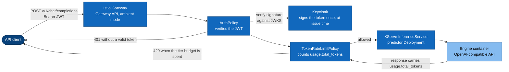
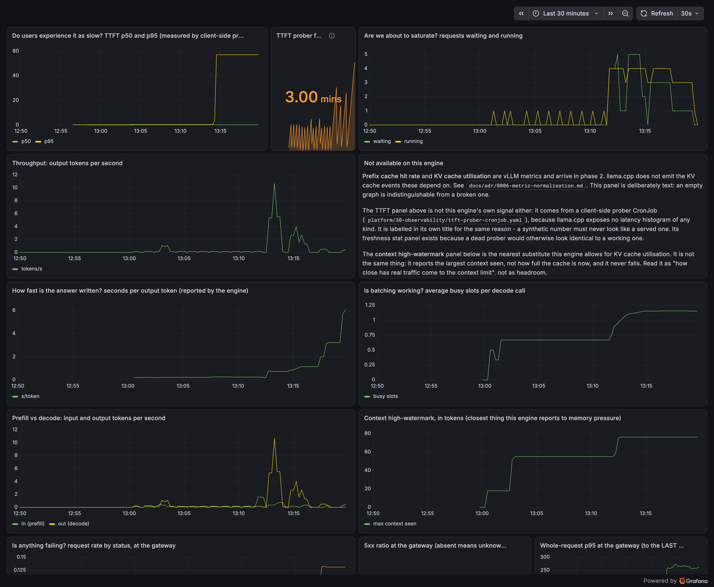
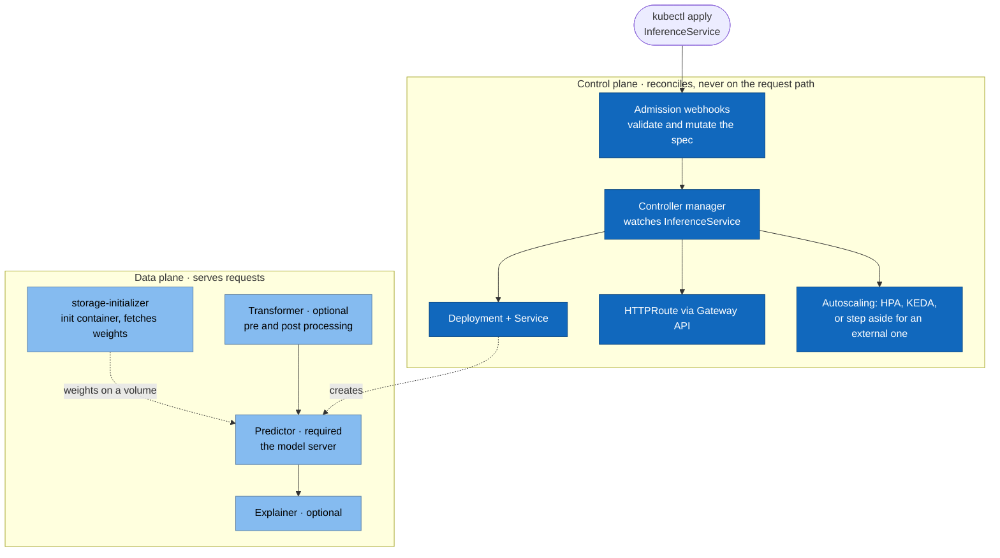
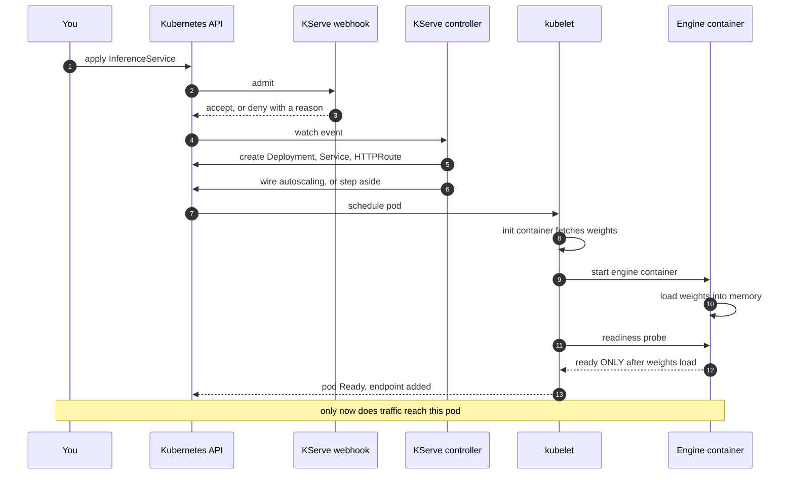
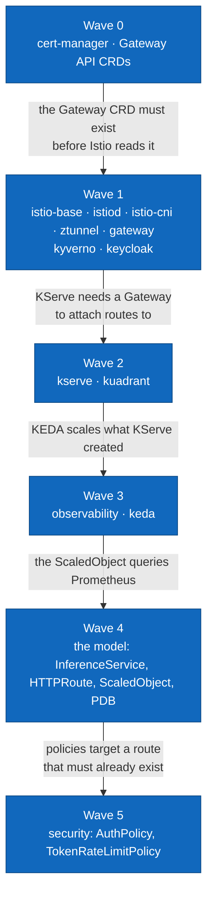
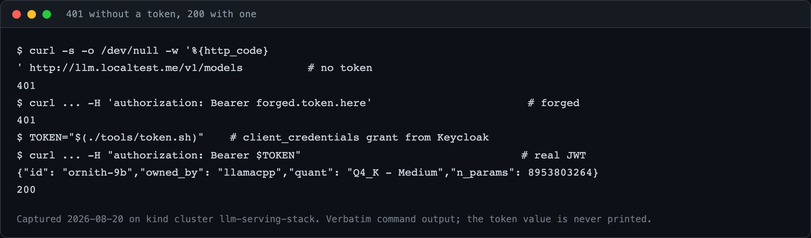
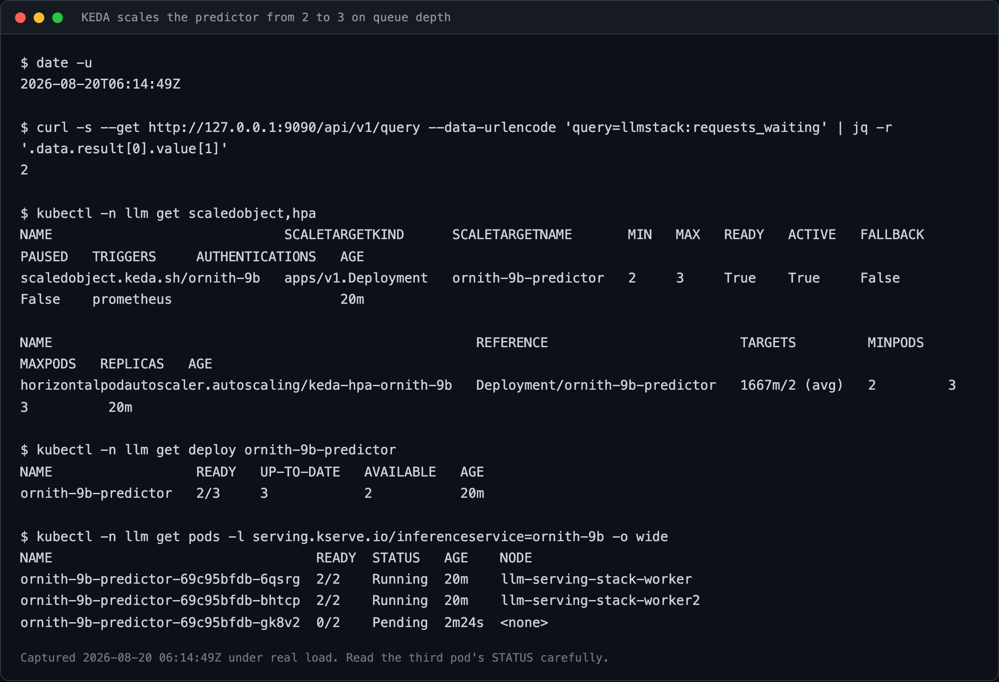
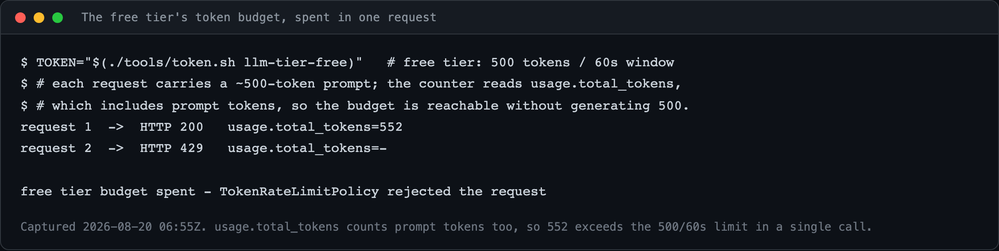
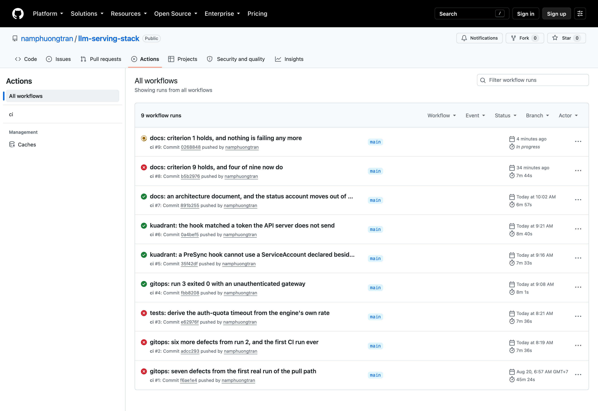

# Everything was green. Anyone could call my LLM.

## What it actually takes to put a model behind an API, and the sixteen layers I found out I needed

Most of us build on a hosted model API. You get a key, you call an endpoint, and
you put an agent on top of it. That is the right choice most of the time, and I
build that way too.

But a question kept coming up, and I kept asking it myself. What if you had to
host the model? Not on a laptop and not as a demo, but properly: something a team
can call, with an address, an identity check, and a budget. How does that work?
What has to exist before the first request succeeds?

I could not find an answer specific enough to act on. Most write-ups stop at
`docker run`. Most reference architectures are diagrams with no measurement
anywhere in them. So I built it on my own machine and wrote down every number.

This is that build. It runs on a three-node `kind` cluster on a Mac mini, with
the same components I would put on a GPU fleet.

**What you can do with it.** The model is a variable in this design. Swap
`models/<name>/` and everything else stands. So you can put your own model behind
it, give it an authenticated endpoint with a per-client token budget, expose it,
and point an agent framework at it like any other OpenAI-compatible provider.

**What you will see on the way.**

- The layers that sit between a client and a model, and the job each one does.
- Five decisions that were expensive to reverse, and what each one cost.
- Eleven traps that cost me real time, with the error message for each.
- What is proven, what is not, and how I tell those two apart.

Now the reason the article is named the way it is. It is also the single most
useful thing that happened during the build.

Sixteen Argo CD Applications reported `Synced` and `Healthy`. The deployment
script exited 0. Every pod was running. I sent a request to the gateway with no
credentials at all, expecting a 401.

It returned HTTP 200, and the model answered.


*All sixteen Applications green, captured 2026-08-20. On that day this same green
list sat over a gateway that served `/v1/models` to a caller with no token.*

Every object had been applied. Nothing was enforcing. The dashboard was green
because the manifests had reached the cluster, which is a completely different
claim from the one I thought I was reading.

That was run 3 of my Kubernetes LLM inference platform, on 2026-08-20. This
article is the architecture I built, the decisions behind it, and the traps that
only appeared when I stopped reviewing the code and started running it.

If you take one thing away, take this: **a model that answers correctly is
maybe fifteen percent of an inference service.** The other eighty-five percent
is everything in this article.

---

## The shape of the problem

A model in a notebook optimises for one question: is the output correct? That is
the right question at that stage. It is a small part of what a service has to do.

Here is the same model, viewed as a service:

| Concern | In the notebook | As a service |
|---|---|---|
| Who is calling | Nobody asks | A signed token, verified before the model is reached |
| What the call costs | Unbounded | Counted and capped, in tokens |
| "Ready" | The process started | Weights are loaded and it can answer |
| Load rises | It slows, then fails | Replicas follow the queue, inside a floor and a ceiling |
| Load falls | Nothing happens | Replicas return to the floor, which is deliberately not zero |
| A node dies | The service dies | Another replica is already on another node |
| How it deployed | Somebody ran a command | A controller pulled it from git |
| Is it fast | Somebody says it feels fine | A number with the date it was measured |

None of the right-hand column is about machine learning. It is all platform
engineering, and it is where the work is.

### Two properties of LLM traffic that break generic advice

Before any component choice, two things make this workload different from
ordinary web serving. Get these wrong and you will build the wrong platform very
efficiently.

**1. Cost is measured in tokens, not in requests.**

`POST /v1/chat/completions` with `max_tokens: 8` and the same call with
`max_tokens: 8000` are indistinguishable to anything that counts requests. The
cost of a request is not known until the request has been answered. So a quota
has to read the response body, not the request.

Every request-per-minute rate limiter you have ever configured is the wrong tool
here.

**2. A saturated engine looks idle on CPU.**

When the GPU is the bottleneck, CPU utilisation tells you nothing about whether
the service is keeping up. A GPU at 100 percent does not tell you either, because
it says nothing about queueing. The signal that means something is **how many
requests are waiting**.

Every HPA on CPU you have ever configured is also the wrong tool here.

Those two sentences decide the policy layer and the autoscaler. Hold on to them.

---

## The architecture

Here is the request path, end to end.



**One design property is worth naming before anything else.** Token verification
happens at the gateway, against public keys fetched from the issuer. Keycloak
signs the token once, at issue time. No datastore is queried on the request path
at all. That is what keeps inference stateless and replaceable pod by pod. State
exists in the platform. It never sits in the request path.

The layers, with the version I run and the reason each one is there:

| Layer | Choice | Version | Why this one |
|---|---|---|---|
| Cluster | kind, Kubernetes v1.36.1 | kind v0.32.0 | Three nodes, so a drain test means something |
| Certificates | cert-manager | v1.21.1 | KServe requires v1.17.0 or higher |
| Gateway | Istio, ambient mode, Gateway API | 1.30.3 | Its data plane is Envoy, which is the whole reason. See below |
| Admission | Kyverno | 3.8.2 | Rejects a floating tag or a missing resource limit before it lands |
| Identity | Keycloak | 26.7.2 | A JWT claim carries the tier, so the quota needs no lookup |
| Model control plane | KServe, Standard mode | v0.20.0 | One contract for every model |
| Request policy | Kuadrant | operator 1.5.2 | It counts tokens, and it runs on either gateway |
| Telemetry | kube-prometheus-stack, OpenTelemetry Collector | 88.5.0, 0.170.0 | Engine metrics normalised into one namespace |
| Autoscaling | KEDA | 2.20.2 | Scales on queue depth, not CPU |
| Delivery | Argo CD | chart 10.4.0 | A laptop cluster has no inbound path for a push pipeline |

Every version above was read from its upstream source on 2026-08-19 and recorded
with the command that read it. Every container image is pinned by digest, never
by a tag, and an admission policy rejects any pod that uses a floating tag.

One term in that table is used before it is explained. **Ambient mode** is Istio
without a proxy inside every pod. It runs one shared proxy per node instead,
which is why it is here: the whole stack has to fit on one machine.

### What each layer is for, in one line each

The table above names products. This one names jobs. If you build something
similar, these are the questions you have to answer, whatever you answer them
with.

Fifteen Argo CD Applications deliver this platform, plus the root Application
that creates them. They group into ten jobs.

| The job | What happens if you skip it | What I used |
|---|---|---|
| Run containers across more than one machine | One machine is one failure and one fixed GPU budget. A drain test means nothing on a single node | Kubernetes, `kind` locally |
| Issue certificates inside the cluster | Several controllers here will not start without a webhook certificate, and KServe requires cert-manager v1.17.0 or higher | cert-manager |
| Take traffic from outside and route it | Something has to own the public address and decide which path reaches which model. Attach a policy to the route once, and every model behind it inherits it | Istio, Gateway API |
| Reject bad manifests before they run | A pod pinned to a floating tag runs different code tomorrow than it ran today, and nothing will tell you. Admission is the last point where "no" is cheap | Kyverno |
| Know who is calling | Without an identity provider, the only thing you can rate-limit on is an IP address, and the only thing you can bill is nobody | Keycloak |
| Give every model the same shape | Hand-written Deployments for two models will not agree on readiness, port names, or labels. Then everything downstream has to know which model it is looking at | KServe |
| Enforce identity and budget on the request path | Checking the caller at the gateway is what keeps the model pod stateless and replaceable. If the model has to know who is calling, you cannot swap it pod by pod | Kuadrant |
| See what is actually happening | A GPU at 100 percent says nothing about whether you are keeping up. Without queue depth and time to first token, "is it slow" has no answer except an opinion | Prometheus, Grafana, OpenTelemetry |
| Add and remove replicas | Inference load arrives in bursts, and a replica costs a GPU. Fixed capacity means paying for the peak all day, or dropping the peak | KEDA |
| Get the manifests onto the cluster | Someone has to apply the YAML. If that someone is your CI system, then your CI system holds a cluster credential, and you made a security decision by accident | Argo CD |

The observability row is the one people cut first. It is also the one that decides
whether you can answer any question later.



*The dashboard under real traffic, 2026-08-20: time to first token at p50 and p95,
requests waiting and running, throughput, batching, and the context
high-watermark.*

Dashboards here read only the normalised `llmstack:` series, never a raw engine
metric. Decision 5 explains why that matters the moment a second engine appears.

---

## Why a model control plane at all

Start with the honest question. Why not hand-write a Deployment, a Service, a
route, and an autoscaler for each model? It is four files. You already know what
they say.

Write them for a second model and the problem appears. Nothing forces the two
sets to agree. One probes `/health`, the other probes a TCP port. One names its
container port `http`, the other names it `api`. One carries the label your
metrics scraper selects on, the other does not. Every consumer downstream now has
to know which model it is looking at.

The readiness case is the sharpest, and it is specific to this workload. A TCP
check reports ready the moment the process binds its port. A model server binds
its port and **then** spends minutes loading weights. So a hand-written Deployment
with a TCP probe puts a pod into service that cannot answer, and Kubernetes will
route to it happily.

KServe's answer is a contract split across two custom resources:

- **`ServingRuntime`** describes the engine. Which image, which arguments, which
  port, and what "ready" means for this engine.
- **`InferenceService`** describes the model. Which weights, how many replicas,
  which resources, which runtime.

Neither knows anything about the other's subject. I enforce that split literally
in the repository layout:

```
runtimes/llamacpp-arm64/     no model name appears anywhere in here
models/ornith-9b/            no engine name appears anywhere in here
```

Swapping the model touches one directory. Swapping the engine touches the other.
Everything downstream then relies on conventions KServe applies once: the
container port named `http`, the label `serving.kserve.io/inferenceservice`, and
the predictor Deployment named `<name>-predictor`. My metrics scraper selects on
the first. My autoscaler targets the third. Neither was told about any particular
model.

That is the payoff. It is not free: KServe is another controller to install,
secure, upgrade, and debug, on a machine already running Istio, Keycloak,
Prometheus, Grafana, and more.

---

## KServe, in enough detail to debug it

KServe splits into a control plane that reconciles objects and a data plane that
serves requests. You interact with the control plane through CRDs. You never talk
to it on the request path.



### Three deployment modes, and the choice is real

| Mode | What it adds | What it costs |
|---|---|---|
| **Standard** | Ordinary Deployment, Service, and HPA | No scale to zero |
| **Knative serverless** | Scale to zero, via Knative's autoscaler and activator | Cold start, plus a second control plane to run |
| **`LLMInferenceService`** | Prefill and decode separation, multi-node orchestration, cache-aware scheduling | A newer surface, needed only at multi-node scale |

I chose Standard. That decision deserves its own section, because scale to zero is
the single most oversold feature in this space.

### Protocols: know which one your engine actually speaks

Predictive workloads use KServe's V1 protocol or the Open Inference Protocol (V2),
over REST and gRPC. Generative workloads use OpenAI-compatible endpoints with
streaming.

This caused a real change in my repository. `ServingRuntime` has a
`protocolVersions` field, and its doc comment at tag v0.20.0 enumerates exactly
what it accepts: `v1`, `v2`, `grpc-v1`, `grpc-v2`. Those are KServe's own protocol
versions. My engine implements none of them. It serves the OpenAI API. There is no
enumerated value that means "OpenAI".

So I omit the field, rather than declare a protocol the engine does not speak.
Omitting it is also functionally correct: `IsProtocolVersionSupported` returns true
on an empty list, and my `InferenceService` names its runtime explicitly instead of
relying on protocol-based selection.

Small thing. It is the difference between a manifest that documents reality and
one that documents a wish.

### The sequence you need in your head

Most failures are one step in this diagram that did not happen, or happened out of
order.



Step 3 is where most mistakes surface, and I will show you mine shortly.
Steps 8 to 12 are the gap between "container started" and "can answer". For a
5.6 GB quantised model that gap is tens of seconds. For a large model on a GPU
node it is minutes.

---

## Five decisions, and what each one cost me

Architecture is the set of choices you cannot cheaply reverse. Here are mine,
each with the evidence and the price.

### 1. Standard mode, not Knative. So no scale to zero by default

Scale to zero is presented everywhere as a free win. It is not free for this
workload, and the pitch never mentions the second half.

Model weights are gigabytes, and on a GPU node they are tens to hundreds of
gigabytes. A pod starting from zero must fetch and load them before it can answer
anything. That is minutes, not seconds. **Scale to zero and availability are in
direct conflict here.**

KServe's own admin guide agrees on the starting point, read 2026-08-17: "Start
with InferenceService, it works for all workloads, both ML and standard LLM."

**Cost accepted:** no scale to zero by default. I keep a separate cost-saving
overlay that does scale to zero, so the cold start becomes a measured number
rather than an opinion. I have not produced that number yet, and I say so rather
than estimating it.

Autoscaling still happens. The floor is just not zero.

### 2. KEDA on queue depth, not an HPA on CPU

This follows directly from property 2 above.

```yaml
apiVersion: keda.sh/v1alpha1
kind: ScaledObject
spec:
  scaleTargetRef:
    name: ornith-9b-predictor
  minReplicaCount: 2
  maxReplicaCount: 3
  triggers:
    - type: prometheus
      metadata:
        serverAddress: http://kube-prometheus-stack-prometheus.observability.svc:9090
        query: sum(llmstack:requests_waiting:by_model{serving_kserve_io_inferenceservice="ornith-9b"}) or vector(0)
        threshold: "2"
```

Two details in that object carry weight.

`minReplicaCount: 2`, not 1, because the PodDisruptionBudget (PDB) beside it has
`minAvailable: 1`. **An autoscaler must never be able to scale below the floor a
disruption budget is supposed to protect.** If it can, the two objects are in a
fight that the disruption budget loses quietly.

The query names no engine. `llmstack:requests_waiting:by_model` is a Prometheus
recording rule, not a raw engine series. More on that in decision 5.

Handing scaling to KEDA needs one annotation, and getting it wrong fails
silently:

```yaml
serving.kserve.io/autoscalerClass: external
```

KServe's default autoscaler class is HPA. Without this annotation KServe creates
its own HorizontalPodAutoscaler on the generated Deployment, and KEDA then refuses
a `ScaledObject` whose target is already owned by another HPA. The `ScaledObject`
never becomes ready. Nothing crashes. Nothing tells you.

The value is `external`, not `keda`, and the difference matters. `keda` makes
KServe's own reconciler generate a `ScaledObject` from the `InferenceService`
spec, which would be a second scaler competing with the one I wrote, using a
trigger the spec cannot express. `external` means "a controller outside KServe
scales this", so KServe creates nothing, and it also cleans up an HPA it created
earlier if you upgrade a cluster that ran without the annotation.

### 3. Istio, because its data plane is Envoy

The framing "Envoy versus Istio versus Traefik" is wrong. **Istio's data plane is
Envoy.** A sidecar is Envoy. An Istio ingress gateway is Envoy. The real comparison
is between a gateway that manages Envoy for north-south traffic only, a mesh that
manages Envoy in both directions, and a different proxy entirely.

One filter decides it for LLM serving. The Gateway API Inference Extension works
through Envoy's external processing filter, `ext_proc`, and the endpoint picker
that performs cache-aware routing **is** an `ext_proc` server. A gateway without
`ext_proc` cannot participate in that decision at all.

Why cache-aware routing is worth planning for: the endpoint picker scores
candidate pods with a prefix cache scorer weighted 2.0 and a load-aware scorer
weighted 1.0. Cache affinity is weighted twice as heavily as spare capacity,
because sending a request to a pod that already holds the matching KV cache blocks
avoids recomputing the prefill entirely.

Ambient mode rather than sidecars, because it runs one ztunnel per node instead of
one proxy per pod, and the whole stack has to fit on one machine.

**Cost accepted:** Istio's inference extension support is alpha, not beta, and
KServe documents Envoy Gateway as its default provider instead. That cost lands in
a later phase, not this one.

### 4. Kuadrant for policy, and the reason is reversibility

The obvious candidate was Envoy AI Gateway, which does token accounting natively.
Its own prerequisites page says plainly: "Envoy AI Gateway is built on top of Envoy
Gateway." I chose Istio, so that door closed.

Kuadrant does the same job with two composable policies:

```yaml
# AuthPolicy: verify the token, and export the claims the quota will need
spec:
  rules:
    authentication:
      keycloak:
        jwt:
          issuerUrl: http://llm.localtest.me/realms/llm
        credentials:
          authorizationHeader: { prefix: Bearer }
    response:
      success:
        filters:
          identity:
            json:
              properties:
                tier: { selector: auth.identity.tier }
                azp:  { selector: auth.identity.azp }
```

```yaml
# TokenRateLimitPolicy: the tier picks the budget, the client id is the counter
spec:
  limits:
    free:
      rates:    [{ limit: 500, window: 60s }]
      when:     [{ predicate: 'auth.identity.tier == "free"' }]
      counters: [{ expression: auth.identity.azp }]
    pro:
      rates:    [{ limit: 100000, window: 60s }]
      when:     [{ predicate: 'auth.identity.tier == "pro"' }]
      counters: [{ expression: auth.identity.azp }]
```

The most valuable property here is not a feature. **Kuadrant installs on either
Istio or Envoy Gateway.** That makes my gateway choice reversible. If a later phase
forces a gateway change, the policy layer survives untouched. When you cannot know
which of two components you will regret, pick the one that keeps the other
replaceable.

Note the design: the tier chooses the limit, and the client id is what gets
counted. Keying the counter on the tier would give every client on a tier one
shared budget. Keying it on the subject would reset every counter whenever the
identity provider restarts.

### 5. Two engines behind one contract

This is the decision I would defend hardest, because it looks like a workaround
and it is not.

My development machine is arm64 with no GPU. Production will be GPU nodes. The
natural wish is to run the same engine in both places. Three findings, all
verified on 2026-08-17, make that impossible without building from source:

1. The obvious runtime image publishes `linux/amd64` only. On arm64 the predictor
   pod cannot pull a usable image at all.
2. Rosetta 2 does not implement AVX, AVX2, or AVX512. The x86 CPU build of vLLM
   depends on them, so emulation ends in an illegal instruction, not in slow
   success.
3. vLLM does support arm64 CPUs, but there is no prebuilt wheel or image. It has
   to be built from source.

So I run two engines: llama.cpp locally, vLLM on GPU nodes, behind an explicit
four-part contract. The OpenAI HTTP surface. Readiness that is true only after
weights load. Prometheus metrics with a required minimum set. An OTLP traces
endpoint.

`ServingRuntime` exists precisely so the engine is a plug-in rather than a
foundation. **A repository that has actually swapped engines has proved that
property. A repository that has only claimed it has not.**

**Cost accepted, including one I did not see coming.** Engine metrics differ, so
Prometheus recording rules normalise both into a single `llmstack:` namespace and
every dashboard, alert, and autoscaler trigger reads only that namespace. That was
planned. What was not planned: llama.cpp emits no traces at all. Its server
documentation mentions neither OTLP nor OpenTelemetry, checked 2026-08-19. So the
fourth part of my own contract is unmet in this phase, and time to first token has
to be measured by a client-side prober instead of derived from spans.

I could have quietly dropped the fourth item. Writing down that my own contract is
three-quarters met is more useful to the next person, including future me.

---

## Deployment order is architecture, not installation trivia

Fifteen Argo CD Applications, plus the root Application that creates them, ordered
by sync wave. A sync wave is a number on each Application, and Argo CD finishes
every Application in one wave before it starts the next. The order is not a
preference. Each wave depends on a CRD or a webhook the previous wave created.



Only two things are ever applied by hand: Argo CD itself, and the root
Application. Everything else arrives by the cluster pulling it. That is a security
decision before it is a convenience one, because it means my CI system never holds
a credential to any cluster.

**The wave 0 edge is the one that produced the opening story.** If the policy
operator starts before the Gateway API CRDs exist, it caches that absence and
refuses every policy afterwards. Nothing crashes, so nothing restarts it.
Kubernetes restart backoff does not apply to a process that is running happily and
doing nothing at all.

That is how sixteen Applications go green over a gateway that authenticates
nobody.

### The two lessons that changed the repository

**Green is not evidence.** An Argo CD Application that fails to read its git path
still reports `health.status: Healthy`. My wait-for-healthy check exited 0 in
**one second**, with zero child Applications created and nothing deployed. It now
reads sync status, counts children against the directory, and requires every
Application green in the same sample.

**Applied is not enforcing.** So my deployment no longer ends by reading the
Application list. It ends by asserting the request path:

```bash
# 1. Unauthenticated must be REJECTED
got="$(code "$BASE/v1/models")"
[ "$got" = "401" ]     # 503 is NOT a pass: it means the gateway is failing
                       # closed and rejecting valid tokens too

# 2. A real token must be ACCEPTED, and a model must be listed
token="$(get_token llm-tier-pro)"
got="$(code "$BASE/v1/models" -H "authorization: Bearer $token")"
[ "$got" = "200" ]
```



*The request path, 2026-08-20: 401 with no token, 401 with a forged token, and
200 with a real JWT serving `ornith-9b`.*

Do not weaken the first assertion to "not 200". A 503 satisfies that, and 503 is
the state where nothing works at all.

---

## Eleven traps, each of which cost me real time

This is the section I would have wanted before starting.

**1. Rendering is not admission.** My template step rendered every model overlay
cleanly and my lint task passed, while the KServe webhook would have rejected all
of them:

```
admission webhook "inferenceservice.kserve-webhook-server.validator" denied
the request: exactly one of [Name, SKLearn, ..., Model, ..., PodSpec] must be
specified in PredictorSpec
```

The cause: I wrote container overrides as a `containers:` entry named
`kserve-container`, next to a `model:` block. KServe counts both as
implementations and demands exactly one. Overrides belong under `model:`.
`initContainers` and `volumes` are not counted that way, which is why they stay at
the predictor level.

**2. Admission is not scheduling.** Under real load, KEDA correctly set
`spec.replicas: 3`, and the third pod can never be scheduled on my cluster. My
autoscaling test passes anyway, because it asserts the number KEDA wrote rather
than the number of pods serving traffic. A passing test is not a working system.



*KEDA scaling on queue depth, 2026-08-20 06:14:49Z. Read the third pod's STATUS
column. `spec.replicas` reached 3, and that pod is `Pending` on node `<none>`,
because `maxReplicaCount: 3` and `maxSkew: 1` with `DoNotSchedule` cannot both
hold on two worker nodes.*

**3. An updated object is not a running workload, and rounding decides it.**
The first push that changed the predictor's pod template can never roll out on
this cluster. `maxSurge` is 25 percent of 2 replicas, which rounds **up** to 1.
`maxUnavailable` is 25 percent of 2, which rounds **down** to 0. So the Deployment
must add a pod before it removes one, and the new pod cannot be scheduled:

```
0/3 nodes are available: 1 node(s) had untolerated taint(s),
2 node(s) didn't match pod topology spread constraints
```

Deleting an old pod does not help. `maxUnavailable: 0` forbids scaling the old
ReplicaSet down, so it refills. Measured 2026-08-21.

Throughout all of it, Argo CD reported the Application `Synced` and `Healthy`,
the `ServingRuntime` on the cluster carried the new spec, and the pod answering
requests carried the old one. That is the opening story of this article again, in
a different component: every object is correct, and the thing serving traffic is
not.

**4. An empty string is not an absent key.** Omitting `storageUri` suppresses
KServe's storage-initializer injection. Setting `storageUri: ""` does **not**. The
guard in the controller source at tag v0.20.0 is:

```go
if sourceURI := predictor.GetStorageUri(); sourceURI != nil {
```

`!= nil`, not `!= ""`. An empty string unmarshals into a non-nil pointer, the
guard passes, and you get an init container and a volume mount you did not ask
for.

**5. A streamed response reports no token usage unless you ask for it.** My quota
reads `usage.total_tokens` from the response. A streamed response that does not
set `stream_options.include_usage` reports no usage at all, so it is counted as
zero. The quota looked correct in a non-streaming test and failed open in real
use.

I measured it on 2026-08-21 by changing that one field and nothing else. Same
tier, same 711-token prompt, same 500-token budget. **With** the field: HTTP 200,
and the next request 429. **Without** it: 200, then 200, then 200. A 711-token
prompt against a budget of 500 cost nothing at all. The gateway had been saying
why once per streamed request, for as long as it had served one:

```
kuadrant_wasm_shim: Missing json property: /usage/total_tokens
kuadrant_wasm_shim: Task failed: Some("4")
```

That `kuadrant_wasm_shim` prefix is the WebAssembly filter Kuadrant loads into
the gateway. It is the piece that reads the response body and does the counting,
so when it cannot find `usage`, nothing is counted.

Every client in this repository now sets the field. **That fixes my clients and it
does not fix the risk.** A caller who omits it still pays nothing, and a caller
who wants free tokens will omit it. A quota the request can switch off is not a
quota. I record it as half fixed, because that is what it is.

**6. When usage is missing, the gateway also refuses to hang up.** Same
measurement, same single field. Identical small requests through the gateway:

| `stream_options.include_usage` | Time to first byte | Total |
|---|---|---|
| absent | 2.38s | 40.93s |
| present | 1.92s | 1.92s |

With the field, the response closes on its last byte. Without it, the same call
takes 40.93 seconds, and the extra time is the shim holding open a connection
whose body is already complete. A larger request delivered all four chunks, ended
with `data: [DONE]`, and then held past both a 120-second and a 420-second client
timeout.

Two consequences. My time-to-first-token prober sets `activeDeadlineSeconds: 45`,
which sits inside that window, and that is the most likely reason its pods were
recorded in `Error`. And **a latency number taken through the gateway by a client
that omits the field is measuring the shim, not the model.**

**7. Being in the token is not enough.** I changed my quota policy to count on the
`azp` claim, and did not export that claim from the auth policy. `azp` was in the
token. Only what the auth policy **exports** is visible to the quota expression.
The gateway logged `CelError::Resolve { NoSuchKey("azp") }` on every request and
counted nothing. The quota failed open, silently.

What makes this one worth telling: my reasoning was that the `tier` claim resolves
by the same mechanism and both are claims in the same token. Both halves were
true. The conclusion was wrong, because the mechanism is the export, not the
token.

Two things came out of it that matter more than the fix.

**A rate-limit expression that cannot resolve fails open, not closed.** A typo in
a counter or in a predicate removes the quota, and the request path looks
perfectly healthy while it does.

**CI caught it, and I had written that nothing would.** My commit message for the
fix said that nothing in this repository would have noticed. That was wrong. Run
`32429474915` failed on the quota test with forty consecutive 200s in 16 seconds,
against a cluster CI had built itself, and it found the fail-open on its own. The
next run confirmed the fix with the same test.

So the gap was never a missing test. The manifest already carried a marker saying
that this exact change was untried. I pushed it anyway, and I learned the answer
from CI rather than from the ten minutes it would have taken to spend a budget
first. **Writing a marker is not the same as acting on one.** The window between
that push and the CI verdict is a window in which the quota was not enforced.

**8. Name your own route something the controller will not generate.** With
Gateway API enabled, KServe generates an `HTTPRoute` named after the
`InferenceService`, in its namespace. A hand-written route with the same name is
the same object, and the KServe controller and Argo CD self-heal will overwrite
each other forever. Mine is suffixed for that reason.

**9. Write out the API defaults your manifest omits.** The API server fills in
`group`, `kind`, and `weight` on route references. A manifest that omits them can
never match the live object, and Argo CD reported those routes `OutOfSync` for the
entire life of the cluster.

**10. Set a long request timeout, or streamed answers truncate.** Streaming runs
for tens of seconds or longer. I set both `request` and `backendRequest` to 600s.
The default cuts responses mid-sentence.

**11. Give every request a timeout and every loop a wall clock.** An unbounded loop
of unbounded `curl` calls hung a CI job for **39 minutes** until the job timeout
killed it. A count is not a bound when each iteration can take arbitrarily long.

I then broke the same rule in my own client. `tools/chat.sh` sent `curl -sN` with
no `--max-time`, and on 2026-08-21 one `task chat` ran past eight minutes. It was
not a hang. It was generation at 0.2 tokens per second, and an unbounded `curl` is
exactly what cannot tell those two apart.

And a related one that is not a trap so much as a discipline: **applying an object
that a just-installed webhook must admit needs a retry.** Neither `helm --wait` nor
`kubectl rollout status` waits for a webhook to become reachable, and four CI runs
died in exactly that gap. The retry has to be narrow: retry on
`failed calling webhook`, and fail immediately on `denied the request`, because a
rejected manifest is a finding, not a flake.

---

## Running it

The whole platform comes up with two commands.

```bash
task preflight     # tools, Docker CPU and memory, helm repo aliases
task local:up      # kind cluster -> Argo CD -> every layer, by sync wave
```

On 2026-08-20, deleting the cluster and rebuilding it took **17 minutes 9
seconds**, exit 0, with no manual step. Most of that is the model download and the
weight load, not the YAML.

This is how that run ends:

```
run started   2026-08-20T05:44:19Z
run finished  2026-08-20T06:01:29Z
elapsed       17m 09.65s
exit          0

all Applications Synced and Healthy (3 of 3 consecutive samples)
16 of 16 Applications Synced and Healthy
verify-serving.sh: unauthenticated request rejected with 401
```

The last line is there because of run 3. The script no longer finishes by reading
the Application list. It finishes by sending a request with no token and requiring
a 401, then sending one with a real token and requiring a 200.

Then the check that matters, because it goes through the gateway and therefore
exercises the route, the auth policy, and the quota policy in one command:

```bash
task chat -- "Explain sync waves in two sentences."
```

And watching the quota do its job:

```bash
CLIENT=llm-tier-free task chat -- "<a prompt of 500 tokens or more>"
# run it again inside the same 60-second window: the second call returns 429
```



*The free tier's budget spent in a single request, 2026-08-20 06:55Z:
`usage.total_tokens=552` against a 500-token limit, and then 429.*

That last one taught me something about my own reasoning. I claimed for a day
that the free-tier quota was unreachable on this engine, arguing from a generation
speed of 0.55 tokens per second. **That reasoning counted generated tokens only.**
`usage.total_tokens` includes the prompt. One request with a roughly 500-token
prompt returned `usage.total_tokens=552`, and the next got 429, measured
2026-08-20. The measurement was right. The sentence I built on top of it was
wrong.

That command also only does what it promises as of 2026-08-21. Until then
`task chat` streamed without asking for usage, so it could spend any number of
tokens and trip nothing. See trap 5.

**Hardware floor, and do not skip this line:** Docker needs at least 8 CPUs and
20 GiB of memory. This repository was code-complete and unrun for two days because
my Docker allocation was 7.7 GiB. Raising it to 23.2 GiB was the only change that
unblocked the first run.

Here is where the memory actually goes, measured 2026-08-19 while installing layer
by layer:

| Layer | Seconds | Memory in use after, MiB |
|---|---|---|
| kind cluster | 14 | 814 |
| Gateway API CRDs | 2 | 1230 |
| cert-manager | 41 | 1546 |
| Istio | 46 | 1992 |
| Kyverno | 63 | 2816 |
| Keycloak | 58 | 3378 |
| KServe | 47 | 3835 |
| Kuadrant | 111 | 4389 |
| Observability | 126 | 5737 |
| KEDA | 47 | 6214 |
| Argo CD | 44 | 7043 |
| The model | 2 | 7089 |
| Security policies | 0 | **17855** |

The last row is not a typo. Memory jumps from 7.1 GiB to 17.9 GiB, because that is
when the weights load and the predictor replicas come up. **The entire platform
costs about 7 GiB. The model costs 10 GiB more.** That ratio is worth knowing
before you size anything.

---

## Where this stands, stated precisely

I am going to be more specific here than posts like this usually are, because
vague claims about production readiness are how teams inherit surprises.

**What is proven, and it has been run, not reviewed:**

- The full stack comes up from an empty machine, by pull-based delivery, with no
  manual step, in 17m09s (2026-08-20).
- The request path enforces identity: 401 with no token, 200 with a valid one.
- Token quota returns 429 on a non-streaming request, both locally and in CI.
- On an arm64 CI runner, the lint and admission-policy jobs pass, and both
  cluster jobs create a real cluster and install the whole platform
  successfully.

**What is not proven, and I will not claim it is:**

- It runs on `kind`, on CPU. The GPU phase, and vLLM with it, is next.
- Under sustained load, 2 of 20 requests returned 500 instead of 401 (2026-08-20).
  Never 200. It fails closed, but 500 is the wrong closed.
- The token quota is opt-in by the caller. A streamed request that omits
  `stream_options.include_usage` is counted as zero (2026-08-21). Every client in
  this repository now sets it, which fixes my clients and not the risk.
- No rolling update of the predictor can complete on this cluster (2026-08-21),
  and Argo CD reports it green throughout.
- The node-drain test and the recovery drill exist and have not been run.
- CI was flaky as of 2026-08-20: four green, four red, then green again.



*The CI run history on 2026-08-20: nine runs, five green and four red. This file
was going to be named `08-ci-green.png`. It was renamed rather than retaken.*

So: **the architecture is production-shaped and proven end to end. The deployment
is not yet production-proven.** What separates those two sentences is GPU hardware
and measurements that only real load produces. That is a phase of work, not a hole
in the design.

I found **eighteen defects by running this**, and four separate static review
passes over the whole repository had missed every one of the first seven: a file
mode, a shell array expansion that only fails on the version macOS ships, two
selectors naming a label Istio removed in 1.24, and three tests that passed while
the thing they named was broken.

That is the real finding, and it generalises well past this stack:

> **Rendering is not admission.**
> **Admission is not scheduling.**
> **An updated object is not a running workload.**
> **A passing test is not a working system.**
> **And a green pipeline is not a working platform.**

Each of those cost me a specific incident with a date. If you are building
something similar, you can have them for free.

---

## What I would tell you to do first

If you are putting a model behind an API, this is the order that worked:

1. **Give the model a contract before you give it traffic.** Runtime and model as
   separate resources, with readiness that is true only after weights load.
2. **Decide scale to zero deliberately.** It is not free when weights are
   gigabytes. Measure the cold start, then choose.
3. **Count tokens, not requests.** A request has no known cost until it is
   answered.
4. **Autoscale on queue depth.** A saturated engine looks idle on CPU.
5. **Normalise your metrics before you build a dashboard.** Otherwise the second
   engine means a second dashboard, and then a third.
6. **Make the cluster pull.** Otherwise CI holds a cluster credential, and you
   made that security decision by accident.
7. **Assert the request path, not the object list.** Everything green and nothing
   enforcing is a real state, and it looks exactly like success.

And the rule underneath all seven, which is the habit I would keep even if I threw
away every component above: **a number without the date it was measured is not
evidence.** Re-measure instead of quoting forward. Every number in this article
carries the date I took it, so that you, or I in six months, can check whether it
is still true.

---

*Built on Kubernetes with KServe, Istio, Kuadrant, Keycloak, KEDA, Prometheus, and
Argo CD. Infrastructure only: manifests, Helm values, shell, admission policies,
and a small benchmark harness. It builds no container image of its own.*
