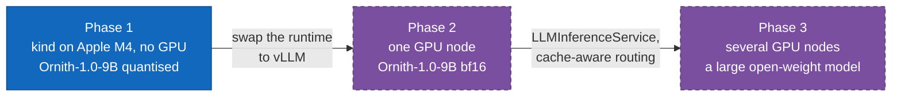

# 1. Introduction and goals

> **Part of:** the [Software Architecture Document](README.md). arc42 section 1.

## What this system is

A Kubernetes platform that serves a large language model over an
OpenAI-compatible HTTP API, with identity, token quota, telemetry, autoscaling,
and pull-based delivery already attached.

It is **infrastructure only**. There is no application code here: the units of
work are Kubernetes manifests, Helm values, shell scripts, Kyverno policies,
bats tests, and a Python benchmark harness. No container image is built by this
repository.

## The question it answers

What is actually missing when a tutorial calls a model deployment "production
ready"?

The usual walkthrough ends with a model answering on `localhost`. That
deployment has no identity, no quota, no telemetry, no autoscaling that means
anything, no failure plan, and no measurements. This repository adds each of
those as its own layer, and records why the layer exists.

## Quality goals, in priority order

| # | Goal | What it rules out | Where it is delivered |
|---|---|---|---|
| 1 | **Every claim is evidence-backed** | A number quoted without the date it was measured; a passing dry-run treated as proof | [`docs/STATUS.md`](../STATUS.md), the `Unmeasured` and `Untried` markers |
| 2 | **The model is a variable** | A model name appearing in a runtime file | [08-crosscutting-concepts](08-crosscutting-concepts.md), boundary 1 |
| 3 | **The engine is swappable** | A dashboard, alert, or scaling trigger naming `llamacpp_*` | [ADR 0006](../adr/0006-metric-normalisation.md), `tests/contract/` |
| 4 | **Cost is counted in tokens** | Rate limiting by request count | [ADR 0004](../adr/0004-policy-layer-kuadrant.md) |
| 5 | **Delivery is pull based** | CI holding a credential to any cluster | [`docs/07-why-gitops.md`](../07-why-gitops.md) |
| 6 | **The substrate is replaceable** | A design that only works with a GPU, or only without one | `models/*/overlays/` |

Goal 1 outranks the rest deliberately. A platform that is wrong about what it
has proven is worse than one that has proven less.

## Scope

**In scope for phase 1:** the whole loop on a laptop. Gateway, identity, policy,
control plane, engine, autoscaling, observability, admission policy, GitOps, CI,
a benchmark harness, and a recovery drill.

**Out of scope, and why:**

| Not here | Reason |
|---|---|
| A GPU | Phase 2. Phase 1 ships every layer except the GPU, so phase 2 is an overlay change |
| vLLM | Cannot run on Apple Silicon without a source build ([ADR 0005](../adr/0005-two-runtimes-one-control-plane.md)) |
| Cache-aware routing | Needs multiple replicas whose KV caches differ, which is phase 3 ([`docs/08-why-llm-d.md`](../08-why-llm-d.md)) |
| Scale to zero by default | Weights are gigabytes; a cold start is minutes ([ADR 0002](../adr/0002-standard-mode-not-knative.md)). The `cost-saving` overlay demonstrates it and is opt-in |
| Cross-backend failover | Not expressible in core Gateway API ([ADR 0007](../adr/0007-failover-not-expressible-in-gateway-api.md)). Withdrawn, not deferred |
| Multi-tenancy beyond two tiers | Two Keycloak clients, `llm-tier-free` and `llm-tier-pro`, are enough to prove the quota mechanism |

## The three phases

Each phase adds hardware, not architecture.

| Phase | New capability |
|---|---|
| 1 | Identity, quota, telemetry, autoscaling, HA drill, CI, benchmark |
| 2 | Real vLLM metrics, prefix caching, honest latency numbers |
| 3 | Cache-aware routing, prefill/decode separation, multi-node parallelism |

## How success is measured

Nine acceptance criteria, each settled by one command. They are the definition
of "phase 1 works", and four of nine held as of 2026-08-20.

[10-quality-requirements](10-quality-requirements.md) carries the table with each
criterion's status, its command, and its date.

## Stakeholders

| Role | What they need from this document |
|---|---|
| Platform engineer | Which component owns which concern, and what breaks if one is removed |
| Model owner | Where a model is defined, and what changing it touches |
| Operator | What runs where, what to watch, and what to do when it fails |
| Reviewer | Which claims are proven, which are not, and how to tell |

## Sources

- [`README.md`](../../README.md), the repository introduction and the stack table.
- [`docs/STATUS.md`](../STATUS.md), the nine criteria and their status.
- ADR 0002 (Standard mode, no scale to zero), ADR 0004 (token-based quota),
  ADR 0005 (the arm64 constraint), ADR 0007 (failover withdrawn).
- [`docs/08-why-llm-d.md`](../08-why-llm-d.md) for what phase 3 must measure.

---

[Index](README.md) · Next: [Constraints](02-constraints.md)
