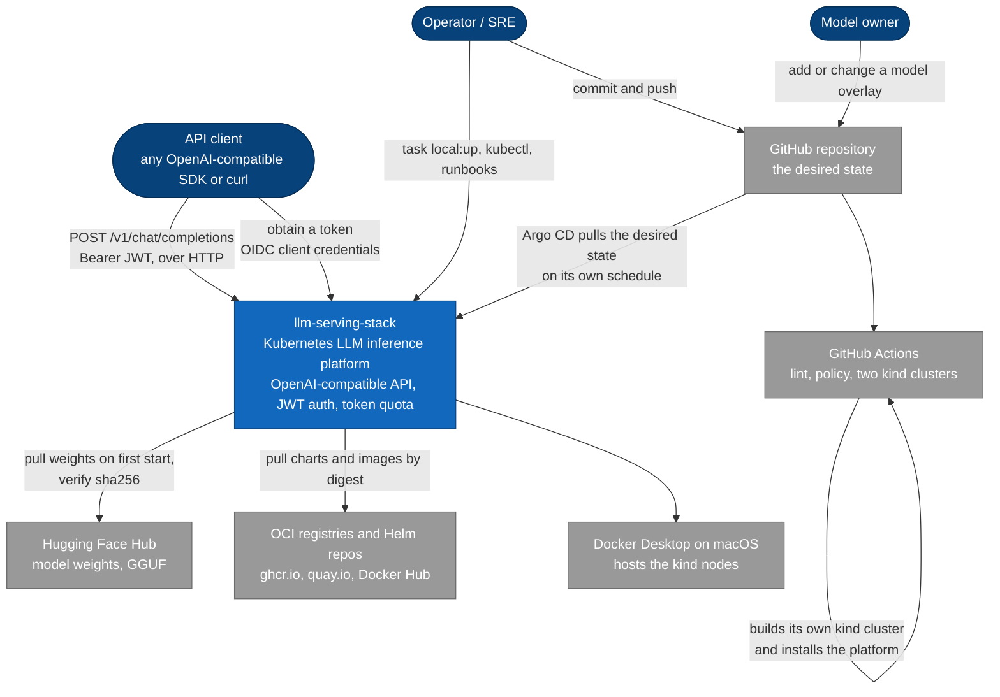

# 3. Context and scope

> **Part of:** the [Software Architecture Document](README.md). arc42 section 3.
> C4 Level 1.

The platform as a single box: the people who use it and the external systems it
depends on. Internal structure starts in
[05-building-blocks](05-building-blocks.md).

Note the direction of the git arrow. **Nothing outside the cluster ever reaches
in.** Argo CD runs inside and pulls. CI holds no credential to any cluster, and
builds its own throwaway cluster instead
([`docs/07-why-gitops.md`](../07-why-gitops.md)).

## Actors

| Actor | What they do at the boundary |
|---|---|
| **API client** | Obtains a JWT from the platform's own Keycloak, then calls `/v1/models` and `/v1/chat/completions` with it. Gets 401 without a token and 429 over quota. `tools/chat.sh` is the reference client |
| **Operator / SRE** | Creates and destroys the cluster, runs the test suites, watches Grafana, and follows the runbooks in [`docs/runbooks/`](../runbooks/) |
| **Model owner** | Adds a directory under `models/`, or changes an overlay. Touches nothing else, because the model is a variable ([08-crosscutting-concepts](08-crosscutting-concepts.md)) |

The operator and the model owner are the same person on a laptop. They are drawn
apart because their reach differs: the model owner changes `models/` and never
`platform/`, and that separation is a design boundary rather than a job title.

## External systems

| System | Direction | Relationship |
|---|---|---|
| **GitHub repository** | Both | The single source of desired state. Argo CD's `root-app` points at `clusters/local-kind/apps` on branch `main` and syncs with `prune: true` and `selfHeal: true` |
| **GitHub Actions** | Outbound from git | Four jobs on `ubuntu-24.04-arm`: `lint`, `policy`, `smoke`, `observability`. The two cluster jobs each create their own real `kind` cluster. CI never deploys to a long-lived cluster |
| **Hugging Face Hub** | Outbound | The `fetch-weights` init container downloads one GGUF file on first start and checks it against a `sha256` recorded in `models/ornith-9b/base/model.yaml`. A mismatch fails the pod rather than serving unknown weights |
| **OCI registries and Helm repos** | Outbound | Every image is pinned by digest and every chart by version, both recorded in `versions.yaml` with the date read. `ghcr.io`, `quay.io`, and Docker Hub are the three hosts |
| **Docker Desktop** | Substrate | Hosts the three `kind` node containers. Its CPU and memory allocation is a hard limit on the whole platform, checked by `task preflight` |

## What the platform owns, and what it does not

**Owns:** the request path and everything on it. Route matching, JWT
verification, token accounting, model serving, autoscaling decisions, metric
normalisation, admission policy, and the reconciliation loop that keeps the
cluster equal to git.

**Does not own:** the model weights, which belong to their publisher under their
own licence; the upstream charts and images, which are pulled and never vendored;
the identity of the caller beyond what the JWT asserts; and the substrate, which
is Docker Desktop today and GPU nodes later.

## Two boundary rules that reappear in every later view

- **No state on the request path.** Keycloak signs a token once, at issue time.
  The gateway verifies the signature against a public key from the JWKS
  endpoint. No datastore is queried while a request is being served, which is
  what lets the predictor be replaced pod by pod
  ([ADR 0004](../adr/0004-policy-layer-kuadrant.md), design property).
- **Quota belongs to an identity, not to a route.** The counter is keyed on the
  `tier` claim inside the JWT, not on the path, because both tiers share
  `/v1/*`. `security/oidc/authpolicy.yaml` extracts the claim and
  `security/oidc/tokenratelimitpolicy.yaml` counts against it.

## One name that surprises people

The gateway host is `llm.localtest.me`, a public name that resolves to
`127.0.0.1`. Inside a pod that means the pod itself, so Authorino could not fetch
the issuer's discovery document and every authenticated request returned 401 with
a valid token. `platform/10-istio/coredns-rewrite.yaml` rewrites the name to the
gateway Service inside the cluster. It was proved by mutation on 2026-08-19:
reverting kind's Corefile brought the 401 straight back, and reapplying the
manifest restored HTTP 200 after about 80 seconds with no restart.

## Sources

- `clusters/local-kind/root-app.yaml` (the repo URL, branch, path, and sync policy).
- `.github/workflows/ci.yml` (the four jobs and the runner).
- `models/ornith-9b/overlays/local/patch-resources.yaml` (the `fetch-weights`
  init container and the `sha256` check), `models/ornith-9b/base/model.yaml`.
- `versions.yaml` (the registries and the pinning rule).
- ADR 0004 for the stateless request path; `platform/10-istio/coredns-rewrite.yaml`
  and [`docs/deployment-walkthrough.md`](../deployment-walkthrough.md) for the
  CoreDNS finding and its mutation proof.

---

[Prev: Constraints](02-constraints.md) · [Index](README.md) · Next: [Solution strategy](04-solution-strategy.md)
