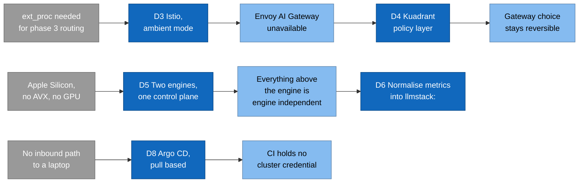

# 4. Solution strategy

> **Part of:** the [Software Architecture Document](README.md). arc42 section 4.

Eight decisions determined everything downstream. Each one is recorded with its
evidence in an ADR or a `why` document; this page is the map, not the record.

## How the decisions chain

Read left to right. A constraint forces a decision, and the decision has a
consequence that the next decision has to live with.

## The eight decisions

| # | Decision | What it buys | Record |
|---|---|---|---|
| D1 | **A control plane, not hand-written Deployments.** KServe `InferenceService` plus `ServingRuntime` | One contract for readiness, port naming, labels, and the predictor Deployment name. A `PodMonitor` and a `ScaledObject` can rely on conventions KServe enforces once | [`docs/02-why-kserve.md`](../02-why-kserve.md) |
| D2 | **KServe Standard mode, not Knative.** No scale to zero by default | Availability. Weights are gigabytes, so a cold start is minutes, not seconds. Knative would also be another control plane on a laptop that already runs six | [ADR 0002](../adr/0002-standard-mode-not-knative.md) |
| D3 | **Istio in ambient mode, through Gateway API** | Its data plane is Envoy, so it can host the `ext_proc` endpoint picker phase 3 needs. Ambient means one ztunnel per node rather than one proxy per pod | [ADR 0003](../adr/0003-gateway-istio-ambient.md) |
| D4 | **Kuadrant for both authentication and quota** | `TokenRateLimitPolicy` reads `usage.total_tokens` from OpenAI-compatible backends. And it installs on either gateway, which is what keeps D3 reversible | [ADR 0004](../adr/0004-policy-layer-kuadrant.md) |
| D5 | **Two engines, one control plane.** llama.cpp on arm64, vLLM on GPU | Development on the real platform rather than a simulation of it. The engine is the only layer that changes between phases | [ADR 0005](../adr/0005-two-runtimes-one-control-plane.md) |
| D6 | **Normalise engine metrics into an `llmstack:` namespace** | No dashboard, alert, or scaling trigger names an engine, so adding vLLM adds a recording-rule expression and changes no panel | [ADR 0006](../adr/0006-metric-normalisation.md) |
| D7 | **Identity is a signed JWT, not an API key table** | No datastore on the request path. The `tier` claim travels inside the token, so the quota counter needs no lookup | [`docs/05-why-keycloak.md`](../05-why-keycloak.md) |
| D8 | **Delivery is pull based.** Argo CD reconciles from git | No network path from CI into any cluster, and no step a human ran once and never wrote down | [`docs/07-why-gitops.md`](../07-why-gitops.md) |

## What was deliberately not chosen

Naming the rejected option is as load-bearing as naming the chosen one, because
each rejection is reversible only if its reason is written down.

| Not chosen | Why not | Reversible? |
|---|---|---|
| **Envoy Gateway** | KServe's documented default, and it does support `ext_proc`. Istio won because Kuadrant had to survive a gateway change and Istio adds east-west mTLS | Yes. The gateway is confined to `platform/10-istio/`, and Kuadrant runs on either |
| **Envoy AI Gateway** | Built on top of Envoy Gateway, which D3 ruled out. Kuadrant fills the same gap | Only by reversing D3 |
| **Traefik** | 100% Gateway API conformance, but no evidence of `ext_proc` support was found, and it is not built on Envoy | Would need evidence that does not exist today |
| **Knative serverless mode** | Scale to zero fights availability for this workload. The `cost-saving` overlay demonstrates it as an opt-in instead | Yes, per overlay |
| **Autoscaling on CPU** | A saturated engine can sit near 100% CPU while a queue grows behind it. CPU cannot tell "busy and keeping up" from "busy and falling behind" | No reason to |
| **Rate limiting by request count** | One request can cost a hundred tokens or a hundred thousand. A request count caps how often, never how much | No reason to |
| **Push-based CD** | Needs a network path from GitHub's runners into a laptop, plus a credential. Both are the wrong thing to build even where they are possible | No reason to |

## The strategy in one sentence

Put every production concern in front of the model on a laptop first, so that
adding a GPU later is an overlay change rather than a rewrite, and prove each
layer by running it rather than by rendering it.

## Sources

- ADR 0002, ADR 0003, ADR 0004, ADR 0005, ADR 0006.
- [`docs/02-why-kserve.md`](../02-why-kserve.md),
  [`docs/05-why-keycloak.md`](../05-why-keycloak.md),
  [`docs/06-why-otel.md`](../06-why-otel.md),
  [`docs/07-why-gitops.md`](../07-why-gitops.md).
- The Traefik and Envoy Gateway comparison is ADR 0003's own options table,
  including its statement that absence of evidence for `ext_proc` on Traefik is
  not proof of absence.

---

[Prev: Context and scope](03-context-and-scope.md) · [Index](README.md) · Next: [Building blocks](05-building-blocks.md)
