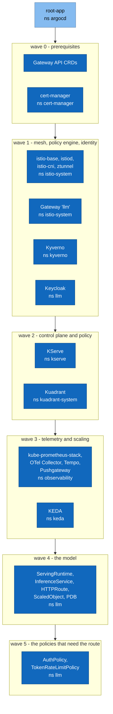
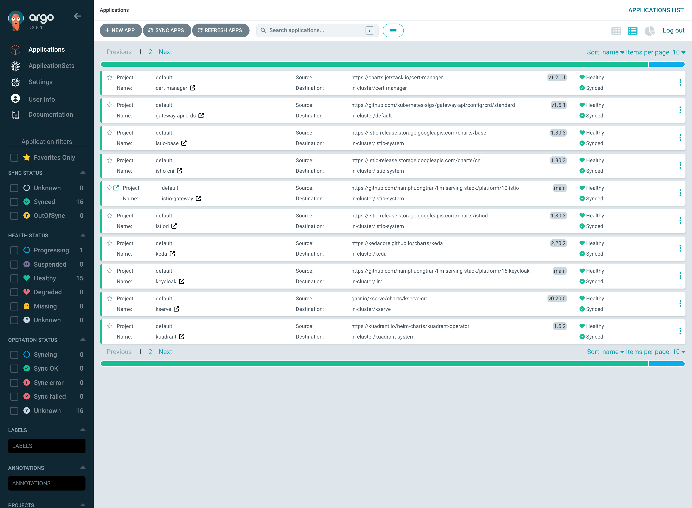
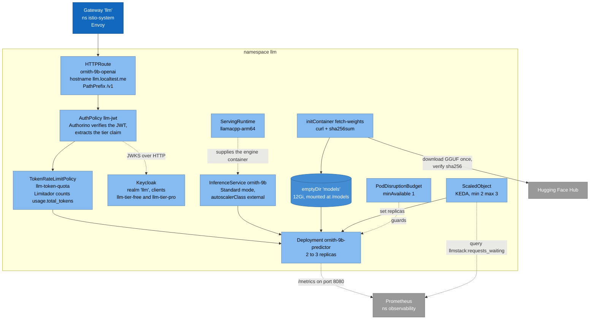

# 5. Building blocks

> **Part of:** the [Software Architecture Document](README.md). arc42 section 5.
> C4 Level 2, then Level 3.

## Level 2: the layers

Fifteen Argo CD Applications, plus the `root-app` that creates them, in six sync
waves. A wave does not start until the previous one reports healthy.

| Wave | Layer | Namespace | Why it is in this wave |
|---|---|---|---|
| 0 | Gateway API CRDs | `default` (the CRDs themselves are cluster-scoped) | Istio fails with `no matches for kind "Gateway"` without them |
| 0 | cert-manager | `cert-manager` | KServe requires v1.17.0 or newer for its webhook certificates |
| 1 | Istio base, istiod, CNI, ztunnel, Gateway | `istio-system` | The data plane must exist before anything routes |
| 1 | Kyverno | `kyverno` | Admission policies must be enforcing before the model pod is created, not after |
| 1 | Keycloak | `llm` | The issuer must be reachable before an `AuthPolicy` can verify against it |
| 2 | KServe | `kserve` | Needs cert-manager from wave 0 |
| 2 | Kuadrant | `kuadrant-system` | Needs the Gateway from wave 1 |
| 3 | Observability | `observability` | The recording rules must exist before the `ScaledObject` queries them |
| 3 | KEDA | `keda` | Needs the metric its trigger reads |
| 4 | Model | `llm` | Needs KServe, the runtime, and the route target |
| 5 | Security policies | `llm` | An `AuthPolicy` targets an `HTTPRoute` by name, so the route must exist first |

**A sync wave is ordering, not a guarantee.** Run 1 of the pull path gave twelve
seconds of ordering in total, because an Application that fails to read its git
path still reports `Healthy` and the next wave started anyway. The check that
actually holds is `clusters/local-kind/wait-for-sync.sh`, which reads sync
status, counts children against the directory, and requires every Application
green in the same sample.

**One ordering problem a wave cannot fix.** The Kuadrant operator reads the
Gateway API CRDs once, at startup, caches the result, and refuses every policy
until it is restarted by hand. Nothing crashes, so nothing restarts it, and the
gateway serves unauthenticated traffic while every Application reports green.
`platform/25-kuadrant/gwapi-wait.yaml` is a `PreSync` hook that stops it at the
source, and `clusters/local-kind/verify-serving.sh` is the assertion that would
catch it anyway.

*Captured 2026-08-20. The sidebar counter is the evidence, not the tiles.
Remember that all sixteen were green on 2026-08-20 while the gateway served
`/v1/models` to a caller with no token.*

## Level 3: inside namespace `llm`

This is where a request is served and where the model lives.

### The objects, and what each one owns

| Object | File | Owns |
|---|---|---|
| `Gateway llm` | `platform/10-istio/gateway.yaml` | One HTTP listener on port 80 for `llm.localtest.me`, exposed as a NodePort |
| `HTTPRoute ornith-9b-openai` | `models/ornith-9b/overlays/local/httproute.yaml` | The `/v1` prefix, the backend Service, and a 600s request timeout because streaming answers run long |
| `AuthPolicy llm-jwt` | `security/oidc/authpolicy.yaml` | JWT verification against `http://llm.localtest.me/realms/llm`, and extraction of `auth.identity.tier` |
| `TokenRateLimitPolicy llm-token-quota` | `security/oidc/tokenratelimitpolicy.yaml` | Two limits keyed on the tier claim: free 500 tokens per 60s, pro 100000 per 60s |
| `ServingRuntime llamacpp-arm64` | `runtimes/llamacpp-arm64/servingruntime.yaml` | The engine: image, args, ports, probes, resources. **No model fact appears here** |
| `InferenceService ornith-9b` | `models/ornith-9b/base/inferenceservice.yaml` | The model: format `gguf`, runtime name, and `--alias ornith-9b`. **No engine fact appears here** |
| `ScaledObject ornith-9b` | `models/ornith-9b/overlays/local/scaledobject.yaml` | Scaling on `llmstack:requests_waiting`, threshold 2, between 2 and 3 replicas |
| `PodDisruptionBudget ornith-9b` | `models/ornith-9b/overlays/local/pdb.yaml` | `minAvailable: 1`, so a node drain cannot take the service out |

The split in the last two rows of the middle block is the whole point of D1.
Swapping the model touches `models/`. Swapping the engine touches `runtimes/`.
Neither touches the other.

### Three details worth knowing before editing

1. **Overrides go under `model:`, never in a container named
   `kserve-container`.** KServe v0.20.0's admission webhook counts `model:` plus
   such a container as two implementations and demands exactly one. Every
   overlay here had this defect, `kustomize build` rendered all of them, and
   `task lint` passed. Rendering is not admission.
2. **Our volume is mounted at `/models`, not `/mnt/models`.** KServe's agent
   injector appends its own `/mnt/models` mount with no duplicate check, and the
   pod fails with `must be unique`. Moving our mount is the fix that leaves the
   agent alone.
3. **`topologySpreadConstraints` uses `DoNotSchedule`, not `ScheduleAnyway`.**
   The availability tests assert that the two replicas land on different nodes,
   and `ScheduleAnyway` would make the manifest and the test disagree. The
   accepted cost is a `Pending` pod when no second node fits one, which is a
   visible failure with a readable reason.

All three are recorded in full, with the upstream source lines, in
`models/ornith-9b/overlays/local/patch-resources.yaml`.

## The other layers, in one line each

| Layer | Directory | What breaks without it |
|---|---|---|
| cert-manager | `platform/00-cert-manager/` | KServe's webhook has no certificate |
| Istio | `platform/10-istio/` | No entry point, and no data plane that can host `ext_proc` in phase 3 |
| Kyverno | `platform/12-kyverno/` | A floating tag or a limitless container reaches the cluster |
| Keycloak | `platform/15-keycloak/` | No issuer, so no JWT and no `tier` claim |
| KServe | `platform/20-kserve/` | Every model needs its own hand-maintained Deployment, Service, and route |
| Kuadrant | `platform/25-kuadrant/` | `/v1/*` is open, or authenticated but unmetered |
| Observability | `platform/30-observability/` | No queue-depth signal, so no autoscaling and no dashboard |
| KEDA | `platform/40-keda/` | Replicas never change with load |
| Argo CD | `platform/50-argocd/` | "Install everything" means running nine scripts by hand in the right order |

Each layer exists twice: as `platform/NN-*/install.sh` for the imperative path,
and as an Argo CD Application for the pull-based path. See
[02-constraints](02-constraints.md), constraint A4, for what that duplication
costs.

## Sources

- `clusters/local-kind/apps/*.yaml` (the fifteen Applications, their sync waves,
  and their destination namespaces), `clusters/local-kind/root-app.yaml`.
- The manifest files named in the object table above, read directly.
- `models/ornith-9b/overlays/local/patch-resources.yaml` for the three details,
  including the KServe v0.20.0 source-line citations recorded there.
- [`docs/deployment-walkthrough.md`](../deployment-walkthrough.md) for the
  twelve-seconds-of-ordering finding and the Kuadrant startup-cache finding.

---

[Prev: Solution strategy](04-solution-strategy.md) · [Index](README.md) · Next: [Runtime view](06-runtime-view.md)
