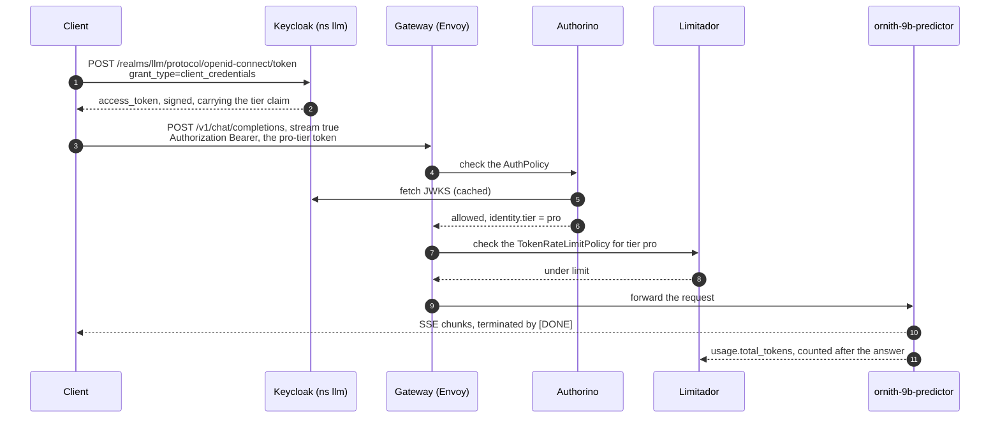
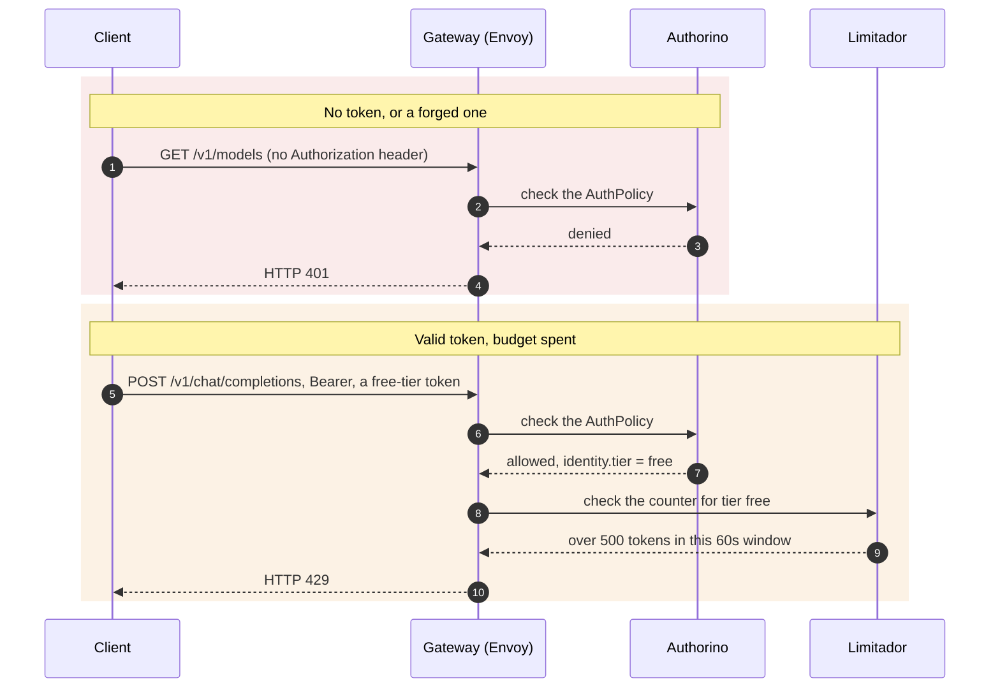
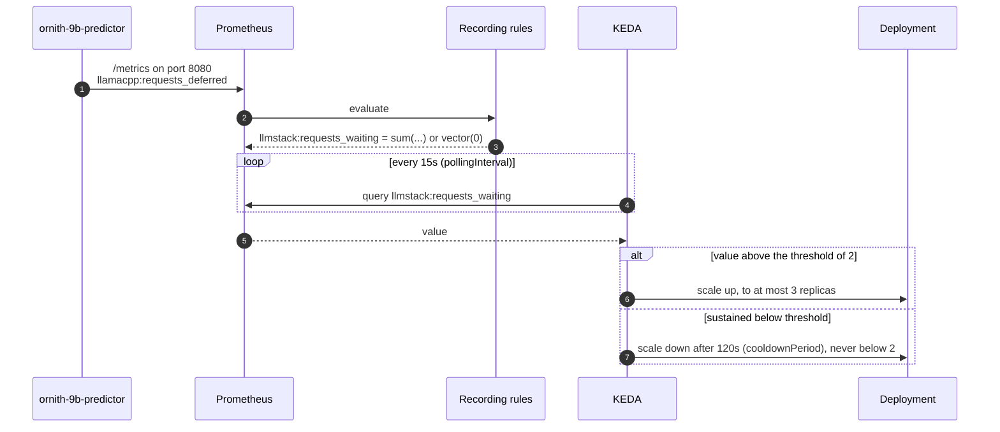
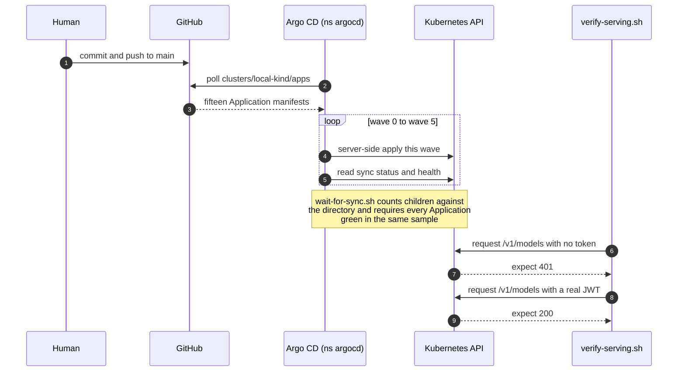

# 6. Runtime view

> **Part of:** the [Software Architecture Document](README.md). arc42 section 6.

Four sequences. Together they cover the request path, both of its rejections,
the scaling loop, and the delivery loop.

## 6.1 A served request

The happy path, from an empty shell to a streamed answer. `task chat` runs
exactly this.

**Why the counting happens last.** The cost of a request is not known until it
has been answered, so `TokenRateLimitPolicy` reads `usage.total_tokens` out of
the response. A request-count limit would cap how often a caller asks, never how
much the asking costs
([`docs/04-why-kuadrant.md`](../04-why-kuadrant.md)).

**Why the route allows 600 seconds.** A streaming answer runs for tens of
seconds, so `httproute.yaml` sets `request` and `backendRequest` timeouts to
`600s`. The predictor also has `terminationGracePeriodSeconds: 120` and a
15-second `preStop` sleep, so a pod finishes the stream it is already writing
instead of being killed mid-answer.

> **Screenshot owed (2026-08-20):** `task chat` streaming an answer through the
> gateway. [`images/README.md`](images/README.md), image 3.

## 6.2 The two rejections

Both rejections happen at the gateway. Neither reaches the engine, so neither
costs a token of compute.

| Tier | Limit | Window | Keycloak client |
|---|---|---|---|
| free | 500 tokens | 60s | `llm-tier-free` |
| pro | 100000 tokens | 60s | `llm-tier-pro` |

**A 503 is not a 401.** The acceptance check asserts 401 without a token and 200
with a real JWT. It must never be weakened to "not 200", because 503 is the
fail-closed case and would satisfy that. `clusters/local-kind/verify-serving.sh`
is the assertion.

**The free tier cannot be exercised on this engine.** llama.cpp reports 0.55
tokens per second here, which is 33 tokens in a 60-second window against a limit
of 500. That is a limits decision, not a test bug. Criterion 4 is settled in CI,
where the CI overlay uses a much smaller model. Measured 2026-08-20; see
[`docs/STATUS.md`](../STATUS.md).

> **Screenshot owed (2026-08-20):** the 401 and 200 pair, and the 429.
> [`images/README.md`](images/README.md), images 4 and 5.

## 6.3 Scaling on queue depth

The signal is the engine's own count of deferred requests, not CPU.

**Why not CPU.** A request queued behind a full batch raises no CPU. The
processor computing the batch already in flight can sit near 100% while a second
request waits its whole turn with nothing on the CPU graph saying so. CPU cannot
tell "busy and keeping up" from "busy and falling behind"
([`docs/06-why-otel.md`](../06-why-otel.md)).

**Why the floor is 2 and not 0.** Weights are gigabytes and a cold start is
minutes. `minReplicaCount: 2` also makes the availability property real: two
replicas on two nodes, guarded by a `PodDisruptionBudget` with
`minAvailable: 1`. Scale to zero exists as the opt-in `cost-saving` overlay,
with its cold start to be measured rather than assumed
([ADR 0002](../adr/0002-standard-mode-not-knative.md)).

> **Screenshot owed (2026-08-20):** KEDA moving the predictor from 2 to 3
> replicas under load. [`images/README.md`](images/README.md), image 7.

## 6.4 Git to cluster

The delivery loop. Nothing outside the cluster reaches in.

**Three properties of this loop were learned by running it, not by design.**

| Finding | Date | What changed |
|---|---|---|
| An Application that cannot read its git path still reports `health.status: Healthy`, so `task local:up` exited 0 in one second on an empty cluster | 2026-08-20 | `clusters/local-kind/wait-for-sync.sh` reads sync status, not health |
| Argo CD applies client-side by default, writing each manifest into a 262144-byte annotation. Five charts here ship CRDs larger than that | 2026-08-20 | `ServerSideApply=true` in `clusters/local-kind/root-app.yaml` |
| Run 3 exited 0 with all sixteen Applications green, and the gateway served `/v1/models` to a caller with no token | 2026-08-20 | `task local:up` now ends with `clusters/local-kind/verify-serving.sh`, which asserts the request path rather than the Application list |

The third one is the reason this document says, in three places, that a green
Argo CD is not evidence.

## Sources

- `tests/lib/helpers.bash` line 117 (the client-credentials grant),
  `tools/chat.sh` (the streaming request).
- `security/oidc/authpolicy.yaml`, `security/oidc/tokenratelimitpolicy.yaml`
  (the two limits and the tier counter).
- `models/ornith-9b/overlays/local/httproute.yaml` (the 600s timeouts),
  `models/ornith-9b/overlays/local/patch-resources.yaml` (the grace period and
  `preStop`).
- `models/ornith-9b/overlays/local/scaledobject.yaml` (poll interval 15s,
  threshold 2, cooldown 120s, min 2, max 3),
  `platform/30-observability/recording-rules.yaml` (the `llmstack:` expressions).
- `clusters/local-kind/root-app.yaml`,
  `clusters/local-kind/wait-for-sync.sh`,
  `clusters/local-kind/verify-serving.sh`.
- [`docs/deployment-walkthrough.md`](../deployment-walkthrough.md) and
  [`docs/STATUS.md`](../STATUS.md) for all three dated findings and the
  0.55 tokens-per-second measurement.

---

[Prev: Building blocks](05-building-blocks.md) · [Index](README.md) · Next: [Deployment view](07-deployment-view.md)
