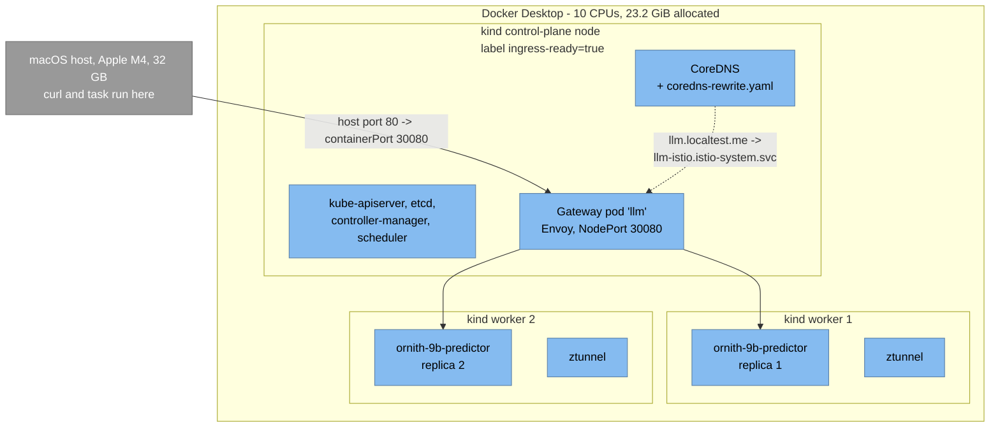
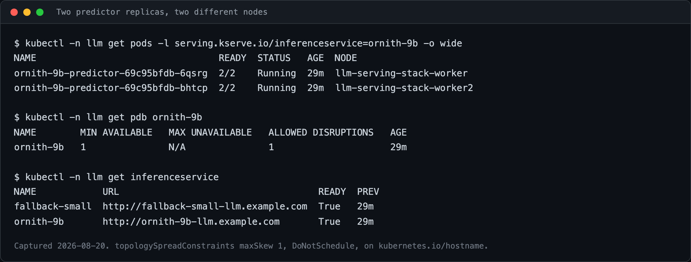
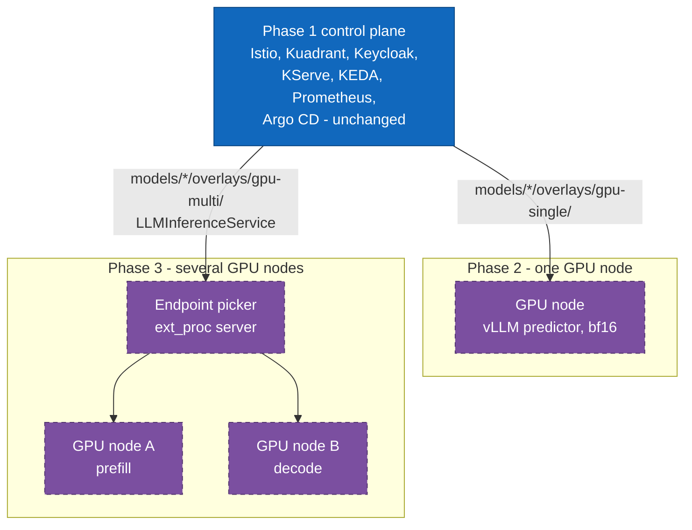

# 7. Deployment view

> **Part of:** the [Software Architecture Document](README.md). arc42 section 7.

## Phase 1: three `kind` nodes on one Mac

| Property | Value | Source |
|---|---|---|
| Cluster name | `llm-serving-stack` | `prereqs/kind-cluster.yaml` |
| Nodes | 1 control-plane, 2 workers | `prereqs/kind-cluster.yaml` |
| Node image | `kindest/node:v1.36.1`, pinned by digest | `versions.yaml`, `kubernetes.kind_node` |
| Kubernetes | v1.36.1, confirmed from a running cluster with `kubectl get nodes -o wide` | `versions.yaml` |
| Ingress | host port 80 to containerPort 30080, host 443 to 30443 | `prereqs/kind-cluster.yaml` |
| Gateway exposure | `networking.istio.io/service-type: NodePort` on the Gateway, plus a `PostSync` hook Job for the exact `nodePort` number, which the annotation does not cover | `platform/10-istio/gateway.yaml`, `platform/10-istio/gateway-service-nodeport.yaml` |
| Preflight floor | 8 CPUs and 20 GiB of Docker allocation | `prereqs/preflight.sh` |

**Why two replicas on two nodes.** `topologySpreadConstraints` uses
`maxSkew: 1` with `DoNotSchedule` on `kubernetes.io/hostname`. The availability
tests assert that the replicas land apart, and the `PodDisruptionBudget` and the
node-drain runbook only mean anything if that is true: with both replicas on one
node, draining that node takes the whole service out.

**Why CoreDNS is patched.** `llm.localtest.me` resolves to `127.0.0.1`, which
inside a pod means the pod. `platform/10-istio/coredns-rewrite.yaml` rewrites it
to the gateway Service. That file replaces kind's whole Corefile, which is only
safe while the node image stays digest-pinned. Read
[`docs/deployment-walkthrough.md`](../deployment-walkthrough.md) before bumping
`kubernetes.kind_node`.

*Captured 2026-08-20. The `NODE` column shows `worker` and `worker2`, and the PDB
allows one disruption. This is the property the node-drain runbook depends on.*

## What each layer costs

Measured 2026-08-19 on the topology above. `mem` is the sum of resident memory
across the three node containers, so it includes the cluster itself.

| Step | Seconds | Pods after | mem | % of 23.2 GiB |
|---|---:|---:|---:|---:|
| `cluster` | 14 | 13 | 814 MiB | 4 |
| `gateway-api-crds` | 2 | 13 | 1230 MiB | 5 |
| `cert-manager` | 41 | 16 | 1546 MiB | 6 |
| `istio` | 46 | 24 | 1992 MiB | 8 |
| `kyverno` | 63 | 28 | 2816 MiB | 11 |
| `keycloak` | 58 | 29 | 3378 MiB | 14 |
| `kserve` | 47 | 30 | 3835 MiB | 16 |
| `kuadrant` | 111 | 37 | 4389 MiB | 18 |
| `observability` | 126 | 46 | 5737 MiB | 24 |
| `keda` | 47 | 50 | 6214 MiB | 26 |
| `argocd` | 44 | 59 | 7043 MiB | 29 |
| `model` | see note | 57 | 7089 MiB | 29 |
| `security` | 0 | 60 | 17855 MiB | 75 |

Two layers dominate the clock: `kuadrant` and `observability` are 237 of the 599
seconds. The model layer dominates memory: about 10.7 GiB between the last two
rows, more than any platform layer. Re-measured 2026-08-20 after a Docker
restart, both models resident: 17576 MiB, 74%. That is a second sample, not a
correction.

Read the `model` row carefully. Its 7089 MiB was written two seconds after
`kubectl apply` returned, long before either model had finished downloading. The
row below it is the first sample taken after both were resident.

Raw log: `docs/deployment-log.tsv`, read with
`column -t -s $'\t' docs/deployment-log.tsv`.

## Phase 2 and 3: GPU nodes

The topology changes. The composition does not.

| Phase | Overlay | Cluster directory | What is new |
|---|---|---|---|
| 2 | `models/ornith-9b/overlays/gpu-single/` | `clusters/gpu-cloud/` | vLLM as a second `ServingRuntime`, real engine metrics, prefix caching, honest latency |
| 3 | `models/ornith-9b/overlays/gpu-multi/` | `clusters/gpu-cloud/` | `LLMInferenceService`, cache-aware routing through the `ext_proc` endpoint picker, prefill/decode separation |

**Both GPU overlays are deliberately empty today.** They contain a valid,
buildable `kustomization.yaml` with `resources: []` and a comment saying why,
because the lint step walks `models/*/overlays/*` and requires every directory
found there to build. They are placeholders with a reason, not oversights.

`clusters/gpu-cloud/` holds the same composition with anything cloud-specific
(storage class, identity, node labels) confined to that directory. It is vendor
neutral by construction.

**Untried (2026-08-20):** no GPU cluster has been created from this repository.
Everything in this section describes where the phase-2 and phase-3 work will
attach, not something that has run.

## Sources

- `prereqs/kind-cluster.yaml` (nodes, node image, port mappings, node label),
  `prereqs/preflight.sh` (the 8 CPU / 20 GiB floor).
- `platform/10-istio/gateway.yaml`,
  `platform/10-istio/gateway-service-nodeport.yaml`,
  `platform/10-istio/coredns-rewrite.yaml`.
- `models/ornith-9b/overlays/local/patch-resources.yaml` (the spread constraint
  and its accepted cost).
- [`docs/deployment-walkthrough.md`](../deployment-walkthrough.md), "What each
  layer costs", and `docs/deployment-log.tsv` for the table above.
- `models/ornith-9b/overlays/gpu-single/kustomization.yaml`,
  `models/ornith-9b/overlays/gpu-multi/kustomization.yaml`,
  `clusters/gpu-cloud/README.md`.

---

[Prev: Runtime view](06-runtime-view.md) · [Index](README.md) · Next: [Cross-cutting concepts](08-crosscutting-concepts.md)
