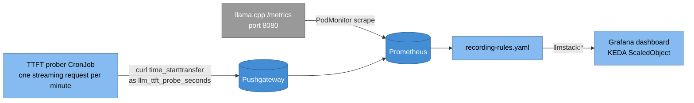

# 8. Cross-cutting concepts

> **Part of:** the [Software Architecture Document](README.md). arc42 section 8.

Four concepts appear in every view. Breaking one is a design change, not a fix.

## 8.1 The four boundaries

```mermaid
graph TB
  subgraph b1["Boundary 1 - the model is a variable"]
    m[models/ornith-9b/]:::comp -.->|"may not name"| r[runtimes/llamacpp-arm64/]:::comp
  end
  subgraph b2["Boundary 2 - the engine is swappable"]
    above["Gateway, policy, identity,<br/>dashboards, tests"]:::comp -.->|"may not name"| eng[any engine]:::comp
  end
  subgraph b3["Boundary 3 - metrics are normalised"]
    raw["llamacpp:* / vllm:*"]:::ext -->|recording rules| norm["llmstack:*"]:::comp
    norm --> cons["dashboards, alerts,<br/>KEDA trigger"]:::comp
  end
  subgraph b4["Boundary 4 - delivery is pull based"]
    g[git]:::ext -->|"Argo CD pulls"| cl[cluster]:::comp
  end

  classDef comp fill:#85bbf0,stroke:#5d82a8,color:#000000
  classDef ext fill:#999999,stroke:#6b6b6b,color:#ffffff
```

| # | Boundary | The rule | How it is kept |
|---|---|---|---|
| 1 | **The model is a variable** | A model name must never appear in `runtimes/`. Changing models touches `models/<model>/` and nothing else | `runtimes/llamacpp-arm64/servingruntime.yaml` names no model; `models/ornith-9b/base/model.yaml` holds every model fact |
| 2 | **The engine is swappable** | Everything above the engine is engine independent | `tests/contract/` exists only to keep it that way |
| 3 | **Metrics are normalised** | Dashboards, alerts, and the KEDA trigger read only `llmstack:*`, never a raw engine series | `platform/30-observability/recording-rules.yaml` |
| 4 | **Delivery is pull based** | `task local:up` applies exactly two things by hand: Argo CD, and `clusters/local-kind/root-app.yaml` | `clusters/local-kind/` |

## 8.2 Metric normalisation

| `llmstack:` name | Source expression |
|---|---|
| `llmstack:requests_running` | `sum(llamacpp:requests_processing) or vector(0)` |
| `llmstack:requests_waiting` | `sum(llamacpp:requests_deferred) or vector(0)` |
| `llmstack:tokens_out_total` | `sum(llamacpp:tokens_predicted_total) or vector(0)` |
| `llmstack:tokens_in_total` | `sum(llamacpp:prompt_tokens_total) or vector(0)` |
| `llmstack:seconds_per_output_token` | `sum(rate(llamacpp:tokens_predicted_seconds_total[5m])) / sum(rate(llamacpp:tokens_predicted_total[5m]))` |
| `llmstack:batch_occupancy` | `avg(llamacpp:n_busy_slots_per_decode)` |
| `llmstack:ttft_seconds:p50` and `:p95` | `quantile_over_time(0.5\|0.95, llm_ttft_probe_seconds[15m])` |
| `llmstack:gateway_requests:rate5m` | `sum by (response_code) (rate(istio_requests_total[5m]))` |

**Adding vLLM changes recording rules, not dashboards.** Every row is keyed by
the `llmstack:` name, not by the engine. Phase 2 adds a second source expression
to each rule, following the pattern the file already comments:
`sum(llamacpp:X) or sum(vllm:Y) or vector(0)`. No panel changes, because no
panel names an engine.

### Three panels this engine cannot fill, stated rather than faked

| Panel | Status | Reason |
|---|---|---|
| Prefix cache hit rate | Not available | vLLM-specific. llama.cpp reports no prefix cache statistics |
| KV cache utilisation | Not available | vLLM-specific. llama.cpp's `/metrics` has no KV-cache-block series |
| Time to first token | **Filled, but not by the engine** | llama.cpp exposes no per-request latency histogram at all, so there is nothing for `histogram_quantile` to consume. A client-side prober CronJob sends one streaming request per minute and measures the delay to the first byte with curl's `time_starttransfer`. The dashboard panel says so in its title, because a synthetic number must never be mistaken for a served one |
| Traces and spans | Not available in phase 1 | llama.cpp's server documentation has zero mentions of OTLP or OpenTelemetry, checked 2026-08-19. The OTel Collector is deployed anyway, with a `traces` pipeline that has no producer, so the GenAI attribute naming lives in one place before phase 2 |

That last row is an accepted gap, not an owed measurement. Nothing closes it
short of adding vLLM.

> **Screenshot owed (2026-08-20):** the Grafana dashboard with real traffic, and
> the Prometheus targets page. [`images/README.md`](images/README.md), images 2
> and 9.

## 8.3 Admission policy

Three Kyverno policies, enforcing in namespace `llm`. They are not advisory.

| Policy | What it rejects | File |
|---|---|---|
| `disallow-floating-tags` | Any image without a digest or a fixed tag, **including throwaway test fixtures** | `policy/disallow-floating-tags.yaml` |
| `require-resource-limits` | Any container, **and any initContainer**, with no limits | `policy/require-resource-limits.yaml` |
| `require-labels` | Any workload missing the required labels | `policy/require-labels.yaml` |

The policies are exercised three ways: `kyverno test policy/tests` offline in CI
and `task policy`, a live Kyverno install at admission in the `smoke` job, and
`tests/smoke/11-policy.bats` against a real cluster. The fixtures are
mutation-checked: reverting the policy under test makes the corresponding case
fail.

**The policy caught a real defect on its own.** KServe's chart renders the
injected agent's image with an empty tag, giving a floating `kserve/agent:v0.20.0`,
and admission rejected the predictor pod. The policy worked exactly as designed;
the fix was to pin the agent by digest in both copies of the KServe values.

Two traps are recorded in the CI workflow's own comments. `kyverno apply policy/`
loads zero rules, because `policy/` also holds a README and a subdirectory: use
`policy/*.yaml`. And applying the policies to rendered model overlays reports
`pass: 0, fail: 0`, because an overlay renders no Pod or Deployment.

## 8.4 Version pinning

`versions.yaml` is the source of truth for every version, digest, and chart.
Every entry carries the date it was read and the command that read it.

| Rule | Reason |
|---|---|
| Images pinned by digest, never a tag | A tag can move. `policy/disallow-floating-tags.yaml` enforces this at admission |
| Charts pinned by version | An unpinned chart makes a deploy unreproducible |
| Every entry carries a `read` date | A version without a date cannot be re-checked |

**Known duplicated copies.** `.github/workflows/ci.yml` writes `kustomize` and
`kyverno_cli` in literally, because it cannot read `versions.yaml` before
installing `yq`. And every Argo CD Application carries rendered digests inline,
because an Application is one git object and cannot read a values file from this
repository. Changing a value means changing both copies; grep for the old
string.

## 8.5 Testing

| Suite | What it protects | Runs where |
|---|---|---|
| `tests/smoke/` | Each layer does what it claims: cluster, gateway, identity, KServe, observability, auth and quota, autoscaling, availability, bench, gitops, policy, recovery | Locally, and a deliberate subset in CI |
| `tests/contract/` | The engine contract, so engines stay swappable: the OpenAI API surface, readiness, and image architecture | Locally and in CI |

Two rules for anything added here, both learned from a CI failure on 2026-08-20:

- **Give every request a `--max-time` and every loop a wall clock.** An unbounded
  loop of unbounded `curl` calls hung the `smoke` job for 39 minutes until
  `timeout-minutes: 45` killed it. A count is not a bound when each iteration can
  take arbitrarily long.
- **Never assert on the stdout of a `kubectl run --rm` pod.** kubectl does not
  reliably produce it: it falls back to streaming logs when it cannot attach, and
  `--rm` can delete the pod first. It still exits 0.

## Sources

- [`CLAUDE.md`](../../CLAUDE.md) for the four boundaries as stated by the
  repository itself.
- `platform/30-observability/recording-rules.yaml` (every expression in the
  table, read directly),
  `platform/30-observability/ttft-prober-cronjob.yaml`,
  `platform/30-observability/podmonitor.yaml`.
- [ADR 0006](../adr/0006-metric-normalisation.md) for the full llama.cpp metric
  list, the commit it was read from, the four unfillable panels, and the
  vLLM-extension pattern.
- `policy/*.yaml`, `policy/tests/`, `.github/workflows/ci.yml` comments.
- `versions.yaml` header and the `charts:` block audit note.
- [`docs/deployment-walkthrough.md`](../deployment-walkthrough.md), "CI, first
  run 2026-08-20", for the two testing rules.

---

[Prev: Deployment view](07-deployment-view.md) · [Index](README.md) · Next: [Architecture decisions](09-architecture-decisions.md)
