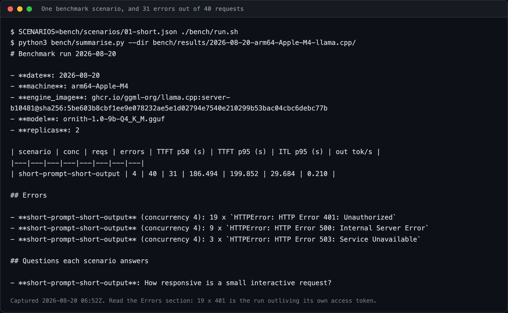

# 10. Quality requirements

> **Part of:** the [Software Architecture Document](README.md). arc42 section 10.

## The nine acceptance criteria

These are the definition of "phase 1 works". Each is settled by one command, and
the command is the requirement: a criterion nobody can run is not a requirement,
it is a wish.

> **[`docs/STATUS.md`](../STATUS.md) is the authority for the status column.**
> The statuses below were copied from it on **2026-08-20**, after criterion 9
> went green. If the two ever disagree, `STATUS.md` is right and this table is
> stale.

| # | Criterion | Status (2026-08-20) | Command that settles it |
|---|---|---|---|
| 1 | `task local:up` takes an empty machine to a ready service | **holds** (2026-08-20), run 4, 17m09s, exit 0 | `task local:down && task local:up` |
| 2 | A JWT obtained from Keycloak returns a streamed chat completion | **holds** (2026-08-19) | `bats tests/smoke/03-identity.bats tests/contract/01-openai-api.bats` |
| 3 | A request without a JWT is rejected with 401 | **holds** (2026-08-19) idle; **degrades under load**, 500 not 401 | `bats tests/smoke/06-auth-quota.bats` |
| 4 | Exceeding the token quota returns 429 | **holds** (2026-08-20), in CI and locally | `bats tests/smoke/06-auth-quota.bats` |
| 5 | Grafana shows TTFT p95 and requests waiting from real traffic | untested | `bats tests/smoke/05-observability.bats` |
| 6 | Under load, KEDA scales the predictor above its floor of 2 replicas, to 3, with evidence | **partly** (2026-08-20): `spec.replicas` reached 3, the third pod cannot schedule, and the test would pass | `bats tests/smoke/07-autoscaling.bats` |
| 7 | Draining a node keeps the service available, the PDB holding | untested | `bats tests/smoke/08-availability.bats` |
| 8 | The recovery drill runs and its recovery time is committed | untested | `task drill:recovery` |
| 9 | CI is green on an arm64 runner | **flaky** (2026-08-20): four green, then two red in `observability` | `gh run list` |

Four of nine hold. The count moved twice on 2026-08-20, in both directions, and
that is the useful thing about it rather than an embarrassment.

**Criterion 1 was settled** on run 4 of the pull path: 17 minutes 9 seconds,
exit 0, sixteen Applications green, and a request path checked independently of
the script that reported it.

**Criterion 9 was recorded as holding and then stopped.** Four consecutive CI
runs were green, which is what the claim was measured on; the next two were red,
both in `observability`, both triggered by documentation-only commits that cannot
break a cluster job. Four samples were not enough to support the word "holds".

**Criteria 3 and 6 gained caveats from the first load test.** The gateway returns
500 rather than 401 under concurrency, and KEDA's third replica can never
schedule. `docs/STATUS.md`, "The first load test", carries all of it.

**Criterion 4 is reachable locally after all**, and this page said otherwise for
a day. The free tier is 500 tokens per 60-second window and llama.cpp generates
0.55 tokens per second, which is 33 tokens per window - conclusive only if the
counter reads generated tokens. It reads `usage.total_tokens`, prompt included.
Measured 2026-08-20 06:55Z: one ~500-token prompt returned
`usage.total_tokens=552`, and the next request got 429.

## Quality attributes and how each is delivered

| Attribute | Scenario | Mechanism | Evidence today |
|---|---|---|---|
| **Security** | An unauthenticated caller reaches `/v1/*` **through the gateway** | `AuthPolicy` verifies the JWT at the gateway, so nothing reaches the engine on that path | Criterion 3 holds |
| **Security** | A pod inside the cluster calls `ornith-9b-predictor` directly | **Nothing does.** This repository holds no `NetworkPolicy` and no Istio `AuthorizationPolicy`; ambient mode gives mTLS, which is not authorisation. The in-cluster path carries neither auth nor quota | Unmitigated. `git grep 'kind: AuthorizationPolicy\|kind: NetworkPolicy'` returns nothing (2026-08-20) |
| **Cost control** | One caller spends the whole budget | `TokenRateLimitPolicy` counts `usage.total_tokens`. The counter is keyed on the `tier` claim, not the caller, so clients sharing a tier share one budget | Criterion 4 holds in CI and locally |
| **Availability** | A node is drained | Two replicas on two nodes, `PodDisruptionBudget` with `minAvailable: 1`, 120s grace and a 15s `preStop` | Criterion 7 untested |
| **Elasticity** | The queue grows | KEDA scales on `llmstack:requests_waiting`, threshold 2, between 2 and 3 replicas | Criterion 6 untested |
| **Observability** | An operator asks whether the service is keeping up | `llmstack:*` recording rules, a Grafana dashboard, and a client-side TTFT prober | Criterion 5 untested |
| **Reproducibility** | The cluster is destroyed | Argo CD rebuilds from git; two things only are applied by hand | Criterion 1 holds, 17m09s |
| **Recoverability** | Namespace `llm` is deleted | `task drill:recovery` measures time to the **first token**, not time to `Ready` | Criterion 8 untested |
| **Portability** | The substrate changes | The same control plane, a different overlay | Untried: no GPU cluster exists |

**Recovery time is measured to the first token deliberately.** Recovery for an
LLM service is dominated by model download, not by applying YAML, so time to
`Ready` would flatter the number. The drill measures the arrival of the first
streamed chunk ([`docs/runbooks/recovery-drill.md`](../runbooks/recovery-drill.md)).

## Performance

No performance number has been produced by this repository. The harness exists
and has never run against a live predictor.

| Scenario | What it measures | File |
|---|---|---|
| `01-short.json` | 32-token prompts, no shared prefix | `bench/scenarios/01-short.json` |
| `02-long-prefill.json` | A long prompt, so prefill dominates | `bench/scenarios/02-long-prefill.json` |
| `03-shared-prefix.json` | A 3,500-token shared prefix across 24 prompts | `bench/scenarios/03-shared-prefix.json` |
| `04-concurrency-sweep.json` | Throughput against concurrency | `bench/scenarios/04-concurrency-sweep.json` |

**First benchmark numbers, 2026-08-20**, scenario `01-short.json`, 40 requests at
concurrency 4 against 2 replicas:

| TTFT p50 | TTFT p95 | ITL p95 | out tok/s | errors |
|---|---|---|---|---|
| 186.494s | 199.852s | 29.684s | 0.210 | **31 of 40** |

**Read the error count before the latency.** Nine were HTTP 500 and three were
503, both the load-induced Authorino failure. Nineteen were **HTTP 401**, and
those are a defect in the harness rather than in the platform: `bench/run.sh:24`
fetches one token, the realm sets `accessTokenLifespan: 900`, and this run took
about 19 minutes. The token expired mid-run. Every scenario in `bench/scenarios/`
takes longer than 15 minutes on this engine, so no benchmark here can currently
complete without this happening.

The latency figures are therefore measured on 9 successful requests out of 40,
under a cluster that was also failing, and should be read as a first data point
rather than as this stack's performance.

> **Unmeasured (2026-08-20):** clean benchmark numbers, from a run whose token
> does not expire and whose gateway is not returning 500. Fix `bench/run.sh` to
> refresh the token, then re-run `task bench` and commit the dated result
> directory.

The comparison worth running first is `03-shared-prefix.json` against
`01-short.json` on the same engine. It shows whatever benefit a **single**
replica's own KV cache reuse gives, which needs no cache-aware routing and no
second replica. It is not the phase 3 claim, and
[`docs/08-why-llm-d.md`](../08-why-llm-d.md) is careful to keep the two apart.


*Captured 2026-08-20. Named `08-ci-runs.png`, not `08-ci-green.png`: four of the
nine runs failed, and retaking it until it looked green is the one thing this
repository forbids.*



*Captured 2026-08-20 06:52Z. The Errors section is the finding: 19 x 401 is the
run outliving its own access token.*

## How claims are kept honest

Two markers, each found with one command, each naming the command that would
settle it.

```bash
git ls-files -z | xargs -0 grep -n '\*\*Unmeasured (20'          # a number nobody measured
git ls-files -z | xargs -0 grep -nE 'Untried \(20[0-9]{2}-'      # a mechanism nobody exercised
```

Counts move, and the direction is expected rather than alarming: every component
added since 2026-08-19 was written and never run, so each one brings its own
marker. [`docs/STATUS.md`](../STATUS.md) carries the counts with their dates, and
explains why the exact form of each pattern matters.

## Sources

- [`docs/STATUS.md`](../STATUS.md) for the nine criteria and every status above.
- `models/ornith-9b/overlays/local/scaledobject.yaml`,
  `models/ornith-9b/overlays/local/pdb.yaml`,
  `models/ornith-9b/overlays/local/patch-resources.yaml` for the elasticity
  and availability mechanisms.
- [`docs/runbooks/recovery-drill.md`](../runbooks/recovery-drill.md) for the
  first-token measurement.
- `bench/scenarios/`, `bench/run.sh`, `bench/summarise.py`, and
  [`docs/08-why-llm-d.md`](../08-why-llm-d.md) for the benchmark section.

---

[Prev: Architecture decisions](09-architecture-decisions.md) · [Index](README.md) · Next: [Risks and technical debt](11-risks-and-debt.md)
