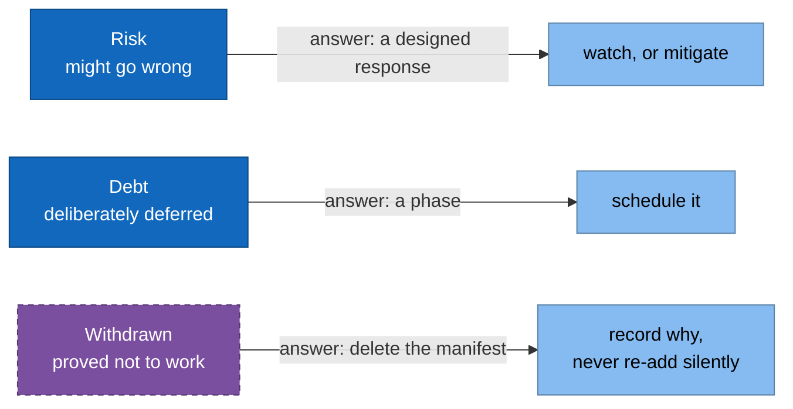

# 11. Risks and technical debt

> **Part of:** the [Software Architecture Document](README.md). arc42 section 11.

Three categories, kept apart because they need different answers.

## Withdrawn: cross-backend failover

**This is not pending. It was proved not to work and removed.**

The design promised that when the engine becomes unavailable, traffic falls back
to a smaller model, using a second `backendRef` at `weight: 0` reached through
retries. Two independent defects killed it:

1. **Weighted cluster selection happens once, and retries do not revisit it.**
   Envoy retries against a different host **inside the already-selected
   cluster**, never against a different cluster. A backend at `weight: 0` is
   never selected on the first attempt and never reconsidered on a retry, so it
   is unreachable.
2. **The retry policy was attached with `spec.gateways: [istio-system/llm]`**,
   a field that expects an Istio-native Gateway. `istio-system/llm` is a Gateway
   API Gateway, which Istio exposes internally under a different autogenerated
   name, so the policy most likely never attached to anything.

Core Gateway API has no failover primitive at all: `HTTPRoute` offers weighted
load splitting and nothing else. Real failover needs an Envoy-native aggregate
cluster, which means an `EnvoyFilter`, which is an escape hatch out of Gateway
API.

**What was done.** The manifest was removed, because a manifest that looks like
failover and delivers none is worse than no manifest: a reader will believe it.
The fallback `InferenceService` stays, because a small model deployed alongside
the primary is independently useful. The availability test that would have proved
failover is **skipped with this ADR as its stated reason**, not deleted and not
left red. A skipped test with a reason is a record; a red test is noise, and a
deleted one is amnesia.

Full record: [ADR 0007](../adr/0007-failover-not-expressible-in-gateway-api.md).

## Risks

| # | Risk | Why it is real | Designed response |
|---|---|---|---|
| R1 | **A green Argo CD is not evidence.** An Application that cannot read its git path still reports `Healthy` | Observed 2026-08-20. `task local:up` exited 0 in one second on an empty cluster | `clusters/local-kind/wait-for-sync.sh` reads sync status and counts children; `clusters/local-kind/verify-serving.sh` asserts the request path |
| R2 | **A controller that reads a CRD once at startup.** The Kuadrant operator caches the Gateway API CRDs and refuses every policy until restarted by hand | Observed 2026-08-20. Nothing crashed, so nothing restarted it, and the gateway served unauthenticated traffic | `platform/25-kuadrant/gwapi-wait.yaml`, a `PreSync` hook; plus R1's request-path assertion |
| R3 | **Every value exists twice.** An Argo CD Application cannot read a values file, so chart values and digests are copied inline | No mechanism detects a half-applied change | Grep for the old string on every change. Stated in [02-constraints](02-constraints.md), A4 |
| R4 | **Two extra components on a laptop.** Authorino and Limitador, on top of Istio, Keycloak, Prometheus, KServe, KEDA, and a 5.6 GB model | The memory ceiling is Docker's allocation | Measured: 17855 MiB, 75% of 23.2 GiB with both models resident (2026-08-19). Accepted in [ADR 0004](../adr/0004-policy-layer-kuadrant.md) |
| R5 | **The CoreDNS manifest replaces kind's whole Corefile** | Only safe while the node image stays digest-pinned | Read [`docs/deployment-walkthrough.md`](../deployment-walkthrough.md) before bumping `kubernetes.kind_node` |
| R6 | **Istio's inference-extension support is alpha**, and its own task page demonstrates sidecar mode rather than ambient | Phase 3 depends on it | The cost falls entirely in phase 3. The gateway is confined to `platform/10-istio/` and Kuadrant runs on either gateway, so [ADR 0003](../adr/0003-gateway-istio-ambient.md) stays reversible |

| R7 | **The auth layer fails open into 500 under concurrency.** Authorino returns gRPC 14 `UNAVAILABLE`, which the gateway renders as HTTP 500, on both the reject path and the accept path | Measured 2026-08-20 under real load: `task chat` failed 3 of 3, and 6 of 10 requests with a valid token returned 500. Recovers when load stops | None yet. It fails closed, never 200 without a token, so it is a reliability defect and not a security hole. `docs/STATUS.md`, "The first load test", finding 2 |
| R8 | **`maxReplicaCount: 3` and `maxSkew: 1` contradict each other on two worker nodes.** KEDA scales to 3 and the third pod can never schedule | Measured 2026-08-20: `0/3 nodes are available: 1 node(s) had untolerated taint(s), 2 node(s) didn't match pod topology spread constraints`. And `tests/smoke/07-autoscaling.bats` asserts `.spec.replicas -gt 2`, so it passes anyway | None yet. Three options exist and each is a design decision: a third worker, a lower `maxReplicaCount`, or `ScheduleAnyway`, which the availability tests forbid |
| R10 | **`bench/run.sh` fetches one token and outlives it.** The realm sets `accessTokenLifespan: 900`; every scenario takes longer than that on this engine | Measured 2026-08-20: 19 of 40 requests failed with HTTP 401 in the first completed benchmark run, which lasted about 19 minutes | None yet. The harness needs to refresh the token during a run. Until then no benchmark number from this machine is clean |
| R9 | **`rollout status` is not a wait for an admission webhook.** Four red CI runs on 2026-08-20, all from documentation-only commits | Measured: 194 ms and 73 ms between `successfully rolled out` and `connect: connection refused`, on the KServe and Kyverno webhooks. `connection refused` on a ClusterIP means no ready endpoints; KServe also probes 8081 while its webhook serves 9443 | **Fixed 2026-08-20.** `platform/lib/apply.sh` retries only the unreachable signature and fails at once on a denial, with a wall clock. Four call sites use it. Proved by three mutation tests; the CI verdict is still owed |

R1 and R2 are the two to internalise. Both produced a system that reported
success while being broken, and neither was visible from the imperative install
path.

R7, R8, and R10 all came from a single afternoon of putting the stack under load
for the first time, on 2026-08-20, and R9 came from watching CI react to it. **None of them was visible from a run that
brings the stack up and asks it one question**, which is what every earlier run
did. R8 in particular is the same shape as the defects this repository already
collects: a test that passes while the thing it names is broken.

## Accepted debt

Deliberate, with the phase that pays it off.

| Debt | Why it was accepted | Paid off in |
|---|---|---|
| No traces at all | llama.cpp emits no OTLP of any kind. The OTel Collector is deployed with a `traces` pipeline that has no producer, so the GenAI attribute naming lives in one place before it is needed | Phase 2, with vLLM |
| Time to first token comes from a client-side prober, not the engine | llama.cpp exposes no per-request latency histogram, so there is nothing for `histogram_quantile` to consume. The panel title says so | Phase 2 |
| No scale to zero by default | A cold start is minutes when weights are gigabytes | Never, by design. The `cost-saving` overlay is the opt-in |
| Both GPU overlays are empty | They hold a valid `kustomization.yaml` with `resources: []` so the lint step, which walks every overlay directory, keeps passing | Phases 2 and 3 |
| Nine imperative `install.sh` scripts kept beside the Argo CD Applications | They remain a working manual bootstrap and a second, independent path to the same end state | Not scheduled |
| `task local:status` and `task drill:drain` are stubs | They print what they would do | Not scheduled |

## What only looks like debt

| Looks like debt | It is not |
|---|---|
| The empty GPU overlays | A placeholder with a stated reason, required by the lint step |
| The skipped availability test | A record of ADR 0007, deliberately not deleted |
| The unused `traces` pipeline | A deliberate placement of attribute naming ahead of phase 2 |

## Sources

- [ADR 0007](../adr/0007-failover-not-expressible-in-gateway-api.md), including
  the Envoy issue it quotes and the second defect the reviewer found.
- [`docs/deployment-walkthrough.md`](../deployment-walkthrough.md) for R1, R2,
  R5, and the memory measurement behind R4.
- [ADR 0003](../adr/0003-gateway-istio-ambient.md) "Cost accepted" for R6,
  [ADR 0004](../adr/0004-policy-layer-kuadrant.md) for R4.
- [ADR 0005](../adr/0005-two-runtimes-one-control-plane.md) and
  [ADR 0006](../adr/0006-metric-normalisation.md) for the traces and TTFT debt.
- `models/ornith-9b/overlays/gpu-single/kustomization.yaml` for the empty-overlay
  reasoning, `Taskfile.yml` for the two stubs.

---

[Prev: Quality requirements](10-quality-requirements.md) · [Index](README.md) · Next: [Glossary](12-glossary.md)
