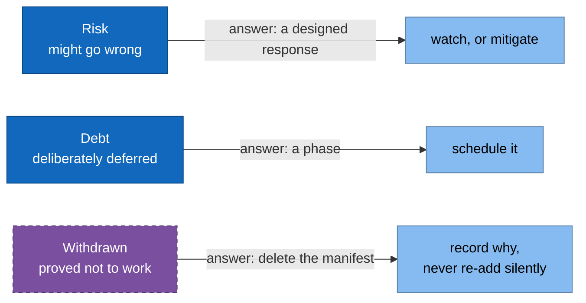

# 11. Risks and technical debt

> **Part of:** the [Software Architecture Document](README.md). arc42 section 11.

Three categories, kept apart because they need different answers.

## Withdrawn: cross-backend failover

**This is not pending. It was proved not to work and removed.**

The design promised that when the engine becomes unavailable, traffic falls back
to a smaller model, using a second `backendRef` at `weight: 0` reached through
retries. Two independent defects killed it:

1. **Weighted cluster selection happens once, and retries do not revisit it.**
   Envoy retries against a different host **inside the already-selected
   cluster**, never against a different cluster. A backend at `weight: 0` is
   never selected on the first attempt and never reconsidered on a retry, so it
   is unreachable.
2. **The retry policy was attached with `spec.gateways: [istio-system/llm]`**,
   a field that expects an Istio-native Gateway. `istio-system/llm` is a Gateway
   API Gateway, which Istio exposes internally under a different autogenerated
   name, so the policy most likely never attached to anything.

Core Gateway API has no failover primitive at all: `HTTPRoute` offers weighted
load splitting and nothing else. Real failover needs an Envoy-native aggregate
cluster, which means an `EnvoyFilter`, which is an escape hatch out of Gateway
API.

**What was done.** The manifest was removed, because a manifest that looks like
failover and delivers none is worse than no manifest: a reader will believe it.
The fallback `InferenceService` stays, because a small model deployed alongside
the primary is independently useful. The availability test that would have proved
failover is **skipped with this ADR as its stated reason**, not deleted and not
left red. A skipped test with a reason is a record; a red test is noise, and a
deleted one is amnesia.

Full record: [ADR 0007](../adr/0007-failover-not-expressible-in-gateway-api.md).

## Risks

| # | Risk | Why it is real | Designed response |
|---|---|---|---|
| R1 | **A green Argo CD is not evidence.** An Application that cannot read its git path still reports `Healthy` | Observed 2026-08-20. `task local:up` exited 0 in one second on an empty cluster | `clusters/local-kind/wait-for-sync.sh` reads sync status and counts children; `clusters/local-kind/verify-serving.sh` asserts the request path |
| R2 | **A controller that reads a CRD once at startup.** The Kuadrant operator caches the Gateway API CRDs and refuses every policy until restarted by hand | Observed 2026-08-20. Nothing crashed, so nothing restarted it, and the gateway served unauthenticated traffic | `platform/25-kuadrant/gwapi-wait.yaml`, a `PreSync` hook; plus R1's request-path assertion |
| R3 | **Every value exists twice.** An Argo CD Application cannot read a values file, so chart values and digests are copied inline | No mechanism detects a half-applied change | Grep for the old string on every change. Stated in [02-constraints](02-constraints.md), A4 |
| R4 | **Two extra components on a laptop.** Authorino and Limitador, on top of Istio, Keycloak, Prometheus, KServe, KEDA, and a 5.6 GB model | The memory ceiling is Docker's allocation | Measured: 17855 MiB, 75% of 23.2 GiB with both models resident (2026-08-19). Accepted in [ADR 0004](../adr/0004-policy-layer-kuadrant.md) |
| R5 | **The CoreDNS manifest replaces kind's whole Corefile** | Only safe while the node image stays digest-pinned | Read [`docs/deployment-walkthrough.md`](../deployment-walkthrough.md) before bumping `kubernetes.kind_node` |
| R6 | **Istio's inference-extension support is alpha**, and its own task page demonstrates sidecar mode rather than ambient | Phase 3 depends on it | The cost falls entirely in phase 3. The gateway is confined to `platform/10-istio/` and Kuadrant runs on either gateway, so [ADR 0003](../adr/0003-gateway-istio-ambient.md) stays reversible |
| R7 | **The auth layer fails open into 500 under concurrency.** Authorino returns gRPC 14 `UNAVAILABLE`, which the gateway renders as HTTP 500, on both the reject path and the accept path | Measured 2026-08-20 under real load: `task chat` failed 3 of 3, and 6 of 10 requests with a valid token returned 500. Recovers when load stops | None yet, and **R11 is the cause**. It fails closed, never 200 without a token, so it is a reliability defect and not a security hole. `docs/STATUS.md`, "The first load test", finding 2 |
| R8 | **`maxReplicaCount: 3` and `maxSkew: 1` contradict each other on two worker nodes.** KEDA scales to 3 and the third pod can never schedule | Measured 2026-08-20: `0/3 nodes are available: 1 node(s) had untolerated taint(s), 2 node(s) didn't match pod topology spread constraints`. And `tests/smoke/07-autoscaling.bats` asserts `.spec.replicas -gt 2`, so it passes anyway | None yet. Three options exist and each is a design decision: a third worker, a lower `maxReplicaCount`, or `ScheduleAnyway`, which the availability tests forbid |
| R9 | **`rollout status` is not a wait for an admission webhook.** Four red CI runs on 2026-08-20, all from documentation-only commits | Measured: 194 ms and 73 ms between `successfully rolled out` and `connect: connection refused`, on the KServe and Kyverno webhooks. `connection refused` on a ClusterIP means no ready endpoints; KServe also probes 8081 while its webhook serves 9443 | **Fixed 2026-08-20.** `platform/lib/apply.sh` retries only the unreachable signature and fails at once on a denial, with a wall clock. Four call sites use it. Proved by three mutation tests; the CI verdict is still owed |
| R10 | **`bench/run.sh` fetches one token and outlives it.** The realm sets `accessTokenLifespan: 900`; every scenario takes longer than that on this engine | Measured 2026-08-20: 19 of 40 requests failed with HTTP 401 in the first completed benchmark run, which lasted about 19 minutes | None yet. The harness needs to refresh the token during a run. Until then no benchmark number from this machine is clean |
| R11 | **The auth path depends on the data path it protects.** Authorino resolves the issuer through the very gateway it is filtering | Read 2026-08-20, in three files. `security/oidc/authpolicy.yaml:30` sets `issuerUrl: http://llm.localtest.me/realms/llm`. `platform/10-istio/coredns-rewrite.yaml:143` rewrites that name to `llm-istio.istio-system.svc.cluster.local`, which is the gateway. `platform/15-keycloak/httproute.yaml:13` puts `/realms` behind the same Gateway. So OIDC discovery travels through the Envoy that is under load | **Confirmed on a live cluster 2026-08-20**, read-only: in-cluster DNS resolves `llm.localtest.me` to `10.96.147.130`, which is the gateway Service `istio-system/llm-istio`, while Keycloak's own Service is `10.96.216.103`. So discovery does traverse the gateway. **This is the cause of R7**, which records only the symptom. Cutting the loop means letting Authorino reach Keycloak's Service directly, so the token's `iss` and the discovery URL stop being one string. Read the `authpolicies.kuadrant.io` v1 schema first, then repeat the 2026-08-20 load test |
| R12 | **Nothing authorises traffic inside the cluster.** Any pod can call `ornith-9b-predictor` with no token and no quota | `git grep 'kind: AuthorizationPolicy\|kind: NetworkPolicy'` returns nothing, 2026-08-20. Namespace `llm` is ambient (`platform/10-istio/namespace-llm.yaml:14`), which gives mTLS, and mTLS is not authorisation. Both Kuadrant policies sit on an HTTPRoute, so they see gateway traffic only | **Attempted on a live cluster 2026-08-20, and reverted. The attempt is the finding.** An `AuthorizationPolicy` in namespace `llm` allowing only `cluster.local/ns/istio-system/sa/llm-istio` and `cluster.local/ns/observability/sa/kube-prometheus-stack-prometheus` did close the bypass: all four in-cluster paths went from HTTP 200 to a reset connection, Pods stayed Ready, and the gateway path stayed correct at 401, then 200, then 11 SSE chunks. **It also killed metrics.** All three predictor scrape targets went `health=down` with `connection reset by peer`, and `llamacpp:requests_deferred` returned nothing at all, which silently takes KEDA's only input with it. The cause, measured: only `llm` carries `istio.io/dataplane-mode: ambient`, so Prometheus is a plain Pod with no SPIFFE identity and its principal can never match, while the gateway matched because its own Pod runs istio-proxy. Deleting the policy restored all three targets to `health=up`. The manifest was **deleted rather than kept**, on ADR 0007's precedent, because `security/oidc/` is a directory source with automated sync and a pushed copy would break metrics unattended. The next move is to enrol `observability` in the mesh, which is its own change with its own verification and has `node-exporter` on host networking in the way |
| R13 | **The token quota counts per tier, not per caller.** Two clients on one tier would share one budget | `security/oidc/tokenratelimitpolicy.yaml:32` and `:40` both read `counters: - expression: auth.identity.tier`. It is invisible today because `platform/15-keycloak/realm-export.json` defines exactly one client per tier, so tier and caller are the same string | **Fixed 2026-08-20.** The counter is keyed on `auth.identity.azp`, the client_id, and `when` still keys on the tier so the limit still comes from there. Not `sub`: `realm-export.json` declares no users, so Keycloak mints the service-account UUID at every import and `start-dev` persists nothing, which would reset every counter whenever the pod restarts. Whether `azp` resolves is Untried, marked in the manifest |
| R14 | **One autoscaling signal for every model.** `ornith-9b` scales on a number that includes `fallback-small`'s queue | Read 2026-08-20, in three files. `platform/30-observability/recording-rules.yaml:35` is `sum(llamacpp:requests_deferred)` with no `by`, so every label is dropped. `platform/30-observability/podmonitor.yaml:20` scrapes every pod carrying `serving.kserve.io/inferenceservice`, which includes `fallback-small-predictor`. `models/ornith-9b/overlays/local/scaledobject.yaml:39` scales on the result. Not observed on a cluster | **Fixed 2026-08-20.** `podTargetLabels` carries the InferenceService name into every predictor series, `llmstack:requests_waiting:by_model` aggregates by it, and the ScaledObject filters on `ornith-9b`. The cluster-wide `llmstack:requests_waiting` stays, because the dashboard reads it unfiltered. The sanitised label name is Untried, and if it is wrong KEDA silently never scales; the marker in `podmonitor.yaml` names the query that settles it |
| R15 | **Auth and quota attach to one named route, so a new route is open by default** | `security/oidc/authpolicy.yaml:25` and `security/oidc/tokenratelimitpolicy.yaml:23` both target `HTTPRoute ornith-9b-openai`. Nothing attaches to the Gateway. A second model with a second route carries neither policy unless somebody remembers to write them | Attach the `AuthPolicy` to the Gateway and override per route, so the default is closed. One trap comes with it: Keycloak's own `/realms` route is on that Gateway, so it needs a route-level policy allowing anonymous, or a token becomes a prerequisite for getting a token |
| R16 | **A model fact lives in `runtimes/`.** The ServingRuntime's memory sizing was chosen for this model | `runtimes/llamacpp-arm64/servingruntime.yaml:74` requests 8Gi and limits 12Gi, sized for a 9B Q4 model with `--ctx-size 4096`. The proof that it is a model fact is `models/ornith-9b/overlays/local/fallback.yaml:64`, where `fallback-small` has to override it to 1Gi and 2Gi | **Fixed 2026-08-20.** `resources` moved into `models/ornith-9b/overlays/local/patch-resources.yaml`. Verified by reading the rendered overlay rather than the source: `ornith-9b` carries 8Gi and 12Gi, `fallback-small` its own 1Gi and 2Gi, the `ci` overlay its own, and the ServingRuntime container renders no `resources` at all. `--ctx-size` and `--parallel` are still in the runtime and deserve the same treatment |
| R17 | **Fetching the weights has no wall clock, and its source is a moving reference** | `models/ornith-9b/overlays/local/patch-resources.yaml:158` runs `curl -fL --retry 3` with no `--max-time` and no `--speed-limit`, so a stalled transfer hangs the init container with no signal but a pod stuck in `Init`. The URL uses `resolve/main`, a mutable ref; `sha256sum -c` makes a changed file fail closed rather than serve wrong, so every replica CrashLoops at once instead | **Half fixed 2026-08-20.** All three fetch sites now carry `--connect-timeout 20 --speed-limit 10240 --speed-time 60`, read back out of the rendered overlays. Deliberately not `--max-time`: a flat cap has to guess a bandwidth for a 5.6 GB file, which is the same objection this repository raised against a `sleep` in the webhook race. The flags parse and run under curl 8.7.1 on macOS; the init image ships curl 8.21.0 and was not tested. **The caching half is open**, and it is a design decision: a hostPath per node, or a PVC with a preload Job. Until it is taken, `docs/deployment-walkthrough.md:233` still holds and a KEDA scale-up cannot answer a spike, because `scaledobject.yaml` polls every 15s and a new replica needs minutes |
| R18 | **One alert exists in the whole repository, and it watches the prober** | `git grep -c 'alert:'` finds exactly one, `TTFTProberStale` at `platform/30-observability/recording-rules.yaml:197`. `llmstack:gateway_error_ratio:rate5m` is recorded at line 164 and nothing reads it, so the one failure mode this repository has actually measured, R7, would raise nothing | **Fixed 2026-08-20.** `LLMGatewayErrorRatioHigh` for R7, `LLMQueueAboveScaleThreshold`, and `LLMPredictorReplicasNotReady` for R8, which `tests/smoke/07-autoscaling.bats` passes straight through. `promtool check rules` on the extracted `.spec` reports 17 rules. One limit to state plainly: `values-prometheus.yaml` sets `alertmanager: enabled: false`, so a firing alert reaches Prometheus and its `ALERTS` series and nothing else. Enabling Alertmanager is its own decision, with the memory cost R4 already records |
| R19 | **Any restart can take the whole service down until a human restarts the gateway.** Envoy fetches the Kuadrant Wasm shim once at startup, fails closed, and never retries | **Measured on a live cluster 2026-08-20**, eight hours into a healthy run, with no bootstrap involved. The Kuadrant operator container died at 13:36:45Z and came back at 13:37:06Z. The gateway exhausted its fetch retries at **13:36:52.999Z**, inside that 21-second window: `Retry limit exceeded for fetching data from remote data source`, then `Plugin kuadrant-wasm-shim failed to load`, then `Plugin configured to fail closed failed to load`. The Service endpoint was healthy again 13 seconds later and Envoy never looked. Every request returned **503**, token issuance included, because Keycloak is behind the same gateway. `kubectl rollout restart deploy/llm-istio` fixed it in one attempt | None yet, and this is the most severe row here: it is unattended downtime with a manual recovery. `docs/deployment-walkthrough.md` treated the same three log lines as a bootstrap ordering problem, which this measurement disproves. Options, none taken: raise Envoy's fetch retry budget, make the shim a local file rather than an HTTP fetch, or add a liveness probe on the gateway that fails when the shim is not loaded so Kubernetes does the restart nobody currently does |
| R20 | **`policy/require-labels.yaml` validates a Deployment's own metadata, so the label it exists to make queryable is missing where it would be queried** | Measured 2026-08-20: `kubectl get pods -n llm` shows `app.kubernetes.io/part-of=llm-serving-stack` on all three predictor Pods and **empty on `keycloak`**. `platform/15-keycloak/keycloak.yaml` sets the label on the Deployment and its Pod template carries only `app: keycloak`; the label does not propagate. The predictors have it only because the InferenceService sets `spec.predictor.labels`. The policy's own message is "so ownership is queryable" | Match the Pod template as well, or match Pods directly. This is not cosmetic: it removed the one namespace-wide selector R12's `AuthorizationPolicy` could have used, which is why that policy has no selector at all |

R1 and R2 are the two to internalise. Both produced a system that reported
success while being broken, and neither was visible from the imperative install
path.

R7, R8, and R10 all came from a single afternoon of putting the stack under load
for the first time, on 2026-08-20, and R9 came from watching CI react to it. **None of them was visible from a run that
brings the stack up and asks it one question**, which is what every earlier run
did. R8 in particular is the same shape as the defects this repository already
collects: a test that passes while the thing it names is broken.

**R11 to R18 are different in kind, and the difference decides how much they are
worth.** Every one came from reading the manifests on 2026-08-20. Nothing was
run. This repository's own record is that reading is weak: four review passes
over the whole tree missed seven defects that the first real run found in one
afternoon. So read these eight as claims about the files, which is what they
are, and not as observations of a cluster. Each row names what would settle it.

Two of them point back at rows above. R11 is the mechanism behind R7, which has
carried "None yet" because the symptom was measured and the cause was not. R18
turns R8 from a silent pass into an alert.

**Five of the eight were fixed on 2026-08-20: R13, R14, R16, R17 in part, and
R18.** Each was verified the way this repository requires, by reading rendered
output rather than source, and by `promtool` for every PromQL expression. Three
of the five owe an `Untried` marker, because a rendered manifest is not an
exercised mechanism.

**R12 was attempted on 2026-08-20 and the attempt failed usefully.** The policy
closed the hole it aimed at and broke a system nobody had connected to it. That
is the third time in two days that a change verified correct on the axis it was
designed for turned out wrong on another axis, after the free-tier quota
arithmetic and the webhook timing. The pattern is not carelessness. It is that
one measurement answers one question, and a fix has to be measured on every axis
it can move.

**R11 and R15 were left alone on purpose, and the reason is not effort.**
Both change the request path: the issuer Authorino trusts, and which object the
policies attach to. Getting either wrong is worse than the risk it closes, since
the failure modes are an open gateway or a service that answers nothing. Do them
on a live cluster, each followed by the 2026-08-20 load test rather than by a
single request, and by a check that metrics are still flowing, which is the one
R12 nearly shipped without.

## Accepted debt

Deliberate, with the phase that pays it off.

| Debt | Why it was accepted | Paid off in |
|---|---|---|
| No traces at all | llama.cpp emits no OTLP of any kind. The OTel Collector is deployed with a `traces` pipeline that has no producer, so the GenAI attribute naming lives in one place before it is needed | Phase 2, with vLLM |
| Time to first token comes from a client-side prober, not the engine | llama.cpp exposes no per-request latency histogram, so there is nothing for `histogram_quantile` to consume. The panel title says so | Phase 2 |
| No scale to zero by default | A cold start is minutes when weights are gigabytes | Never, by design. The `cost-saving` overlay is the opt-in |
| Both GPU overlays are empty | They hold a valid `kustomization.yaml` with `resources: []` so the lint step, which walks every overlay directory, keeps passing | Phases 2 and 3 |
| Nine imperative `install.sh` scripts kept beside the Argo CD Applications | They remain a working manual bootstrap and a second, independent path to the same end state | Not scheduled |
| `task local:status` and `task drill:drain` are stubs | They print what they would do | Not scheduled |

## What only looks like debt

| Looks like debt | It is not |
|---|---|
| The empty GPU overlays | A placeholder with a stated reason, required by the lint step |
| The skipped availability test | A record of ADR 0007, deliberately not deleted |
| The unused `traces` pipeline | A deliberate placement of attribute naming ahead of phase 2 |

## Sources

- [ADR 0007](../adr/0007-failover-not-expressible-in-gateway-api.md), including
  the Envoy issue it quotes and the second defect the reviewer found.
- [`docs/deployment-walkthrough.md`](../deployment-walkthrough.md) for R1, R2,
  R5, and the memory measurement behind R4.
- [ADR 0003](../adr/0003-gateway-istio-ambient.md) "Cost accepted" for R6,
  [ADR 0004](../adr/0004-policy-layer-kuadrant.md) for R4.
- [ADR 0005](../adr/0005-two-runtimes-one-control-plane.md) and
  [ADR 0006](../adr/0006-metric-normalisation.md) for the traces and TTFT debt.
- `models/ornith-9b/overlays/gpu-single/kustomization.yaml` for the empty-overlay
  reasoning, `Taskfile.yml` for the two stubs.
- R11 to R18 carry their sources inline, as a file and a line each, because every
  one of them is a claim about a file rather than a measurement. Open the line
  before believing the row.

---

[Prev: Quality requirements](10-quality-requirements.md) · [Index](README.md) · Next: [Glossary](12-glossary.md)
