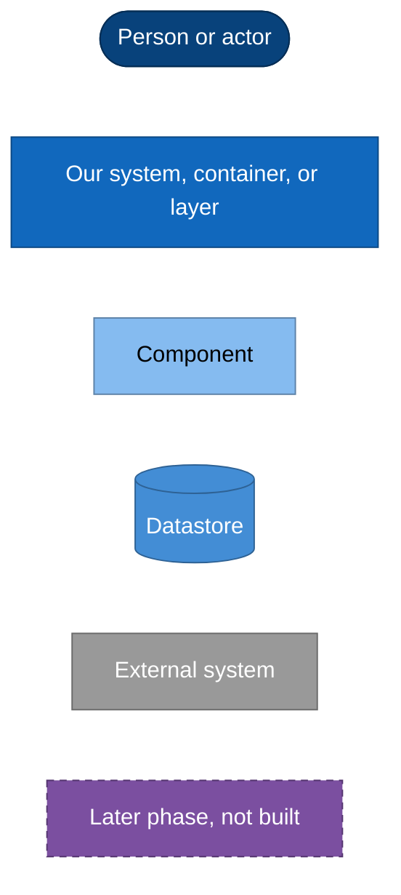

# Software Architecture Document

**System:** `llm-serving-stack`, a cloud-native LLM inference platform on
Kubernetes, released under Apache-2.0.

**Notation:** the [C4 model](https://c4model.com) at Levels 1 to 3, plus
sequence and deployment diagrams, all rendered as Mermaid.

**Structure:** the chapter sequence follows the **arc42** template's twelve
sections, one section per file.

> arc42 is by Dr. Gernot Starke and Dr. Peter Hruschka,
> [arc42.org](https://arc42.org), licensed CC BY-SA 4.0. Only the section
> sequence is used here. No arc42 text, explanation, or diagram is reproduced.

## How to read this

Read `01` to `12` in order for the whole picture, or jump to the view that
answers your question. **Every file is short and leads with a diagram.** The
detail lives in the ADRs, and this layer points at them.

### The problem (arc42 1 to 3)

| File | Topic | Diagram |
|---|---|---|
| [01-introduction-and-goals](01-introduction-and-goals.md) | What this system is for, and the nine criteria that say it works | - |
| [02-constraints](02-constraints.md) | The hardware, architecture, and process rules nothing here may break | - |
| [03-context-and-scope](03-context-and-scope.md) | Actors and external systems, with the system as one box | C4 L1 |

### The answer in short (arc42 4)

| File | Topic | Diagram |
|---|---|---|
| [04-solution-strategy](04-solution-strategy.md) | The eight decisions that determined everything downstream | Decision map |

### The structure (arc42 5 to 7)

| File | Topic | Diagram |
|---|---|---|
| [05-building-blocks](05-building-blocks.md) | The thirteen layers, then the inside of namespace `llm` | C4 L2, C4 L3 |
| [06-runtime-view](06-runtime-view.md) | Four sequences: a served request, a rejected one, a scale-up, a git sync | Sequence x4 |
| [07-deployment-view](07-deployment-view.md) | Three `kind` nodes today, GPU nodes in phase 2 and 3 | Deployment x2 |

### Cross-cutting (arc42 8)

| File | Topic | Diagram |
|---|---|---|
| [08-crosscutting-concepts](08-crosscutting-concepts.md) | The four boundaries, metric normalisation, admission policy, version pinning | 2 |

### Decisions (arc42 9)

| File | Topic |
|---|---|
| [09-architecture-decisions](09-architecture-decisions.md) | Every ADR, what it decided, and which view cites it |

### Quality and risk (arc42 10 and 11)

| File | Topic |
|---|---|
| [10-quality-requirements](10-quality-requirements.md) | The nine acceptance criteria, each with its status and its command |
| [11-risks-and-debt](11-risks-and-debt.md) | Known risks, accepted debt, and one withdrawn capability |

### Vocabulary (arc42 12)

| File | Topic |
|---|---|
| [12-glossary](12-glossary.md) | LLM-serving and platform terms, each pointing at its document of record |

## C4 legend

This document uses C4 Levels 1 to 3 and stops there. Level 4, code, does not
apply: this repository contains no application code.



| Class | Colour and shape | Meaning |
|---|---|---|
| `person` | Dark blue stadium | Person, actor, or role |
| `host` | Medium blue rectangle | Our system, container, or layer |
| `comp` | Light blue rectangle | A component inside a container (C4 L3) |
| `store` | Blue cylinder | Datastore or volume |
| `ext` | Grey rectangle | External system, not ours |
| `v2` | Purple dashed | Phase 2 or 3, designed but not built |

A solid arrow is a synchronous call. A dashed arrow is asynchronous, optional,
or a later phase. The arrow label states the protocol or the intent.

## Where this layer sits

```text
docs/adr/          decisions and why        (authority for a decision)
      |
docs/sad/  <- THIS LAYER                    the coherent picture across views
      |
docs/STATUS.md     what is actually proven  (authority for a claim about reality)
```

Three rules, and they are not negotiable:

1. **An ADR is the authority for a decision.** If this document contradicts an
   accepted ADR, this document is the bug.
2. **This layer introduces no decision.** Where a topic is undecided, it is
   labelled as such rather than settled here.
3. **This layer asserts nothing about what has run.**
   [`docs/STATUS.md`](../STATUS.md) is the authority for that. A design
   described here may never have executed. Where that matters, the file says so
   with a date.

## Evidence discipline

This repository is stricter than the default, and this document follows the same
rules ([`CLAUDE.md`](../../CLAUDE.md)):

- **A number without the date it was measured is invalid.** Every measurement
  here carries the date it was taken.
- **A citation must hold the claim, not sit beside it.** Every claim names the
  file, the ADR, or the manifest that establishes it.
- **What has not been observed is marked.** `> **Unmeasured (<date>):**` for a
  number nobody has measured, `**Untried (<date>):**` for a mechanism nobody has
  exercised, and `> **Screenshot owed (<date>):**` for an image this document
  wants and does not yet have.

## Screenshots

Ten images belong in this document. **Seven exist**, captured from a running
cluster on 2026-08-20. Three are blocked, two of them by a defect this
repository now has a record of rather than by the capture tooling.
[`images/README.md`](images/README.md) lists each one, how it was produced, the
command that reproduces it, and for the missing three, what blocks it.

Two of the seven do not show what the plan expected, and both are kept as they
came out: the KEDA image shows a third replica that can never schedule, and the
CI image shows four red runs. Retaking either until it looked right is the one
thing this repository forbids.

## License

Apache License 2.0. See [`LICENSE`](../../LICENSE) and [`NOTICE`](../../NOTICE).

---

Next: [Introduction and goals](01-introduction-and-goals.md)
